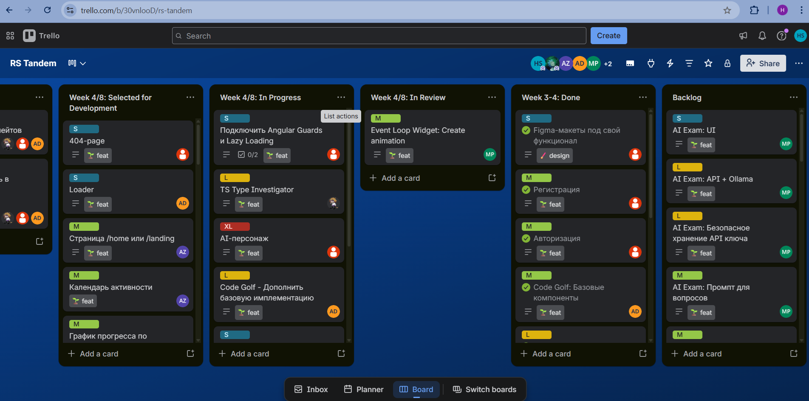

# Code Forge

Code Forge is an interactive application designed to help users prepare for technical interviews and strengthen their hard skills in JavaScript and Typescript.<br>
It combines learning and practice in a gamified format to make technical preparation more engaging and effective.
<br>
Additional AI Assistant is eager to help a trainee in learning process.

Set of interactive games:

- Code Golf
- Async Sorter
- AI Exam
- Code Sandbox
- Type Investigator
- Code Review

Personal Dashboard with statistics reflects progress of the registered users.

This content is available after registration and login, in Russian and English.

## We Are Proud Of

- We have implemented the first app with Angular. This first step was difficult but rewarding 🚀
- We've built some shared UI-components (buttons, inputs, etc.) without using UI libraries. Custom design has been created from scratch and is documented in Figma.
- Almost all our games use Supabase. The Dashboard data is also taken from Supabase. DB connection is implemented by trainees, without mentor's code. BaaS Auth is supported.
- AI Exam uses Gemini via Supabase Edge Function proxy. Again without mentor's code! Now, we know how to build a prompt, what AI models exist, what are their pros and cons.
- We have touched RxJS... ☠️ There's a lot of to learn, but no turning back anymore.
- We've improved our understanding of Web Workers -- Code Golf game is based on it.
- CDK Drag-n-drop became a perfect fit in Async Sorter and Type Investigator, so now we can use it in our projects.
- Monaco Editor, ngx-markdown, highlight-js are in our professional toolkit now as well.
- We've used Transloco with EN + RU to localize the app. Translations are loaded from both JSON and Supabase.
- Our code is covered with unit tests. They are written with Vitest.

## Table of Contents

- [Team](#team)
- [Deploy](#deploy)
- [Team Processes](#team-processes)
- [Technologies](#technologies)
- [Development](#development)

## Team

| Name | Role | Github | Development notes |
| ---- | ---- | ------ | ----------------- |
| Aleksei Drob | Fullstack Engineer and Database Wizard | [aliakseidrob](https://github.com/aliakseidrob) | [notes](./development-notes/aliakseidrob) |
| Mark Pribylnov | Fullstack Engineer and CI/CD Warrior | [mark-pribylnov](https://github.com/mark-pribylnov) | [notes](./development-notes/mark-pribylnov) |
| Alexandr Zhdanko | Frontend Engineer and UX/UI Magician | [Zhdko](https://github.com/Zhdko) | [notes](./development-notes/zhdko) |
| Vsevolod Timoshenko | Frontend Engineer and Our Secret Weapon | [shoblinsky](https://github.com/shoblinsky) | [notes](./development-notes/shoblinsky) |
| Anatoliy Rubankov | Fullstack Engineer and AI Pioneer | [anatolirub](https://github.com/anatolirub) | [notes](./development-notes/anatolirub) |
| Hanna Surmach | Mentor and World's Best Boss | [khasekai](https://github.com/khasekai) | |
| Raman Kamarou | Mentor and Engineering Grandmaster | [PoMaKoM](https://github.com/PoMaKoM) | |

## Deploy

[Deploy link](https://luminous-biscuit-6fec26.netlify.app/)

## Team Processes

### Kanban Board

[Trello board](https://trello.com/b/30vnlooD/rs-tandem)



### Meeting Notes

- [Weekly Sync #4](https://docs.google.com/document/d/1deMkN9TBNqXL6cWgjV_phSVQiweeYUNDUblqL7qXTsE/edit?tab=t.0)
- [Weekly Sync #5](https://docs.google.com/document/d/1deMkN9TBNqXL6cWgjV_phSVQiweeYUNDUblqL7qXTsE/edit?tab=t.l8qfflwwjp4f)
- [Weekly Sync #6](https://docs.google.com/document/d/1deMkN9TBNqXL6cWgjV_phSVQiweeYUNDUblqL7qXTsE/edit?tab=t.gq0dpqwhvhnl)
- [Weekly Sync #7](https://docs.google.com/document/d/1deMkN9TBNqXL6cWgjV_phSVQiweeYUNDUblqL7qXTsE/edit?tab=t.29g63gjvc0lb)

### Code Review (Some PRs with cross-review)

- [feat: code sandbox](https://github.com/PoMaKoM-RSTeam/Rs-Tandem/pull/58)
- [feat: code golf add check solution](https://github.com/PoMaKoM-RSTeam/Rs-Tandem/pull/57)
- [feat: animate moving blocks to final call stack](https://github.com/PoMaKoM-RSTeam/Rs-Tandem/pull/37)
- [feat: sandbox add functionality
](https://github.com/PoMaKoM-RSTeam/Rs-Tandem/pull/72)
- [feat: ai-exam improvements and refactoring](https://github.com/PoMaKoM-RSTeam/Rs-Tandem/pull/71)

## Week 5 Checkpoint
[video link](https://youtu.be/nxAmDsMHFuk)

## Demo

[Final Demo Link (up to 8 min)](https://youtu.be/o1w2O3H1CXc)

## Technologies

| Software | Version |
| -------- | ------- |
| Angular  | 21.1.4  |
| Husky    | 21.1.4  |
| Prettier | 3.8.1   |
| Vitest   | 4.0.8   |

## Development

To install dependencies:

```sh
npm i
```

To run a dev server:

```sh
ng serve
```
