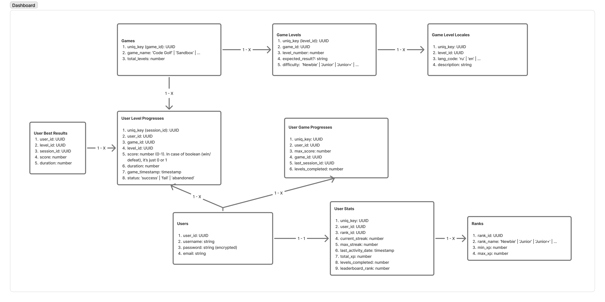
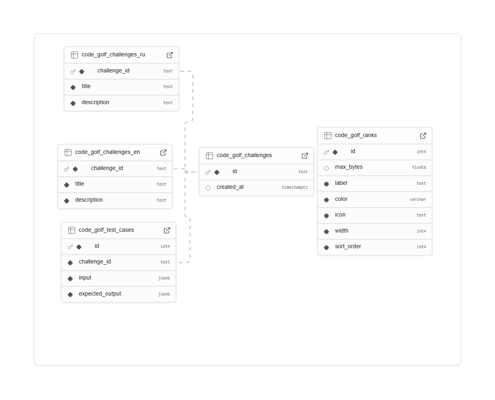
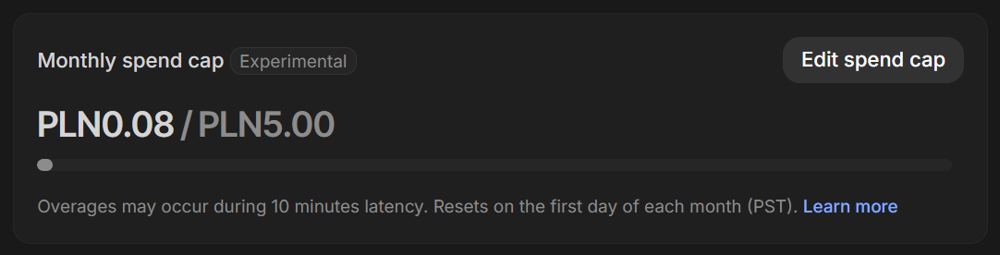

# 15.02.2026

Вызвался на CI/CD потому что надо браться за всё новое даже если вообще не знаешь как делать.
Сначала берёшь задачу, а потом разбираешься как делать.
Чтобы с приходом на любой следующий проект список того что умеешь всегда расширялся.

Думал будет долго и непонятно.
Оказалось что это один файл сделать. За 3-4 часа справился. Видимо не получится засчитать это как "компонент" :)

Pipeline срабатывает на push и pull request в ветку main. Запускает линтер, prettier и если там всё хорошо то запускает build проекта потому что зачем билдить если на предыдущих этапах была ошибка. Поэтому порядок имеет значение.
Тесты не запускает потому что их нет.

Ещё в CI/CD бывает что нужно Docker немного настроить, но это не в нашем случае. Хотя с ним тоже никогда не работал.
Если случай будет в более сложных проектах надо сразу браться на это дело. И не важно какой сложности проект будет.
Теперь в резюме можно смело записывать что могу сделать CI/CD.

Дальше делаем event loop game. Надо разбить на подзадачи чтобы понять сколько времени это займёт и что конкретно делать.

PR: https://github.com/PoMaKoM-RSTeam/Rs-Tandem/pull/2

<details>
<summary>Такой файл получился:</summary>

```name: GitHub Actions
run-name: Production deployment triggered by ${{ github.actor }}

on:
  push:
    branches: [main]
  pull_request:
    branches: [main]

permissions:
  contents: read
  pages: write
  id-token: write

jobs:
  build_and_test:
    runs-on: ubuntu-latest
    strategy:
      matrix:
        node-version: [24.x]

    steps:
      - uses: actions/checkout@v4

      - name: Setup Node.js ${{ matrix.node-version }}
        uses: actions/setup-node@v4
        with:
          node-version: ${{ matrix.node-version }}

      - name: Install dependencies
        run: npm ci

      - name: Format with Prettier
        run: npm run format

      - name: Run Linter
        run: npm run lint

      - name: Build Project
        run: npm run build

      - name: Upload Build Artifact
        uses: actions/upload-pages-artifact@v3
        with:
          path: ./dist/rs-tandem/browser

  deploy:
    needs: build_and_test
    if: github.ref == 'refs/heads/main'
    runs-on: ubuntu-latest
    environment:
      name: github-pages
      url: ${{ steps.deployment.outputs.page_url }}

    steps:
      - name: Deploy to GitHub Pages
        id: deployment
        uses: actions/deploy-pages@v4        
```
</details>
  

  
# 17.02.2026

Сделал небольшой план из чего будет состоять Event Loop Game и примерный срок выполнения.<br>
Получилось 4 пункта.<br>
Не уверен нужно ли разбивать логику ещё глубже. Вроде это самое основное, но всего лишь 4 пункта.<br>

Оценка в сторипоинтах для нашего случая не очень подходит, поэтому договорились ставить как S, M, L или XL.<br>

Схема: https://excalidraw.com/#json=RCOwg1MqvpDoHQ7aRiowS,LTZL2vaQPCG6WhIzIhtL6Q

План и временная оценка:

1. Create UI elements - `L`
2. Add drag and drop for code blocks and buckets. Including minimal UI effects: on drop, on hover, highlight drop areas - `M`
3. Create animation of moving blocks from buckets to output when button 'run loop' pressed - `L`
4. Prevent user from dropping code blocks in wrong order (e.g. if the next micro task is block 2 but the user tries dropping block) - `M`

Блокеры:

- не знаю Angular,
- drag and drop тоже надо подтянуть (в rss-puzzle делал, но там получилось не идеально).
- С анимацией работал мало, только знаю что примерно гуглить надо

Что дальше:

- начать разбираться с Angular и делать UI элементы.
- Посмотреть файл с командного созвона по Angular, читать документацию и на ютубе небольшой crash course глянуть.


# 19.02.2026

## Разбираемся что такое этот Angular.

Начал читать Essentials в документации.  
Компоненты и как их делать это конечно хорошо, но как разобраться в куче папок и файлов которые есть в проекте, что куда писать чтобы вывело 'Hello world'?

Создал папку для своего виджета, скопировал из документации пример и словил несколько предупреждений от линтера.  
Паника.  
Нужно создать каркас проекта с нуля чтобы во всём разобраться.  
Потому можно будет вернутся к tandem когда структура Angular станет понятна.

Через 2 часа перешёл уже к тем самым Essentials.

Решил делать проект в Курсоре.  
Попросил его выделить из проекта самое ключевое что надо понимать полному новичку чтобы начать делать первый компонент.  
Если в ответах Курсора нужно копать глубже чтобы понять что происходит но там уже не нужен контекст проекта, то копирую часть его ответа в Gemini в браузере чтобы экономить токены Курсора.

#### Интересное в Angular:

- для работы с SVG и HTTP запросами (и многими другими вещами) нужно сказать Ангуляру об этом. Это для того чтобы если делаешь лендинг то HTTP там не надо, а если фреймворк из коробки будет давать весь функционал то для многих проектов это будет лишний код, лишнее время загрузки. Если будешь использовать этот расширенный функционал но забудешь явно указать то будет ошибка.
- есть ограничения по "весу" проекта. Если build превышает значение в `angular.json` (свойство `budgets`) то будет выведет ошибку (например что загрузка будет долгая через мобильный интернет).
- роутинг это сказка. Намного проще чем вручную писать логику и меньше шансов словить баг.

### Итого:

- Стало многое понятнее. Возможно не всё так сложно как казалось.
- Сделал простую разметку в HTML для компонента.  
  Затраченное время: 5 часов

### Что дальше:

Перевести разметку HTML в компоненты с логикой.


# 20.02.2026

### Что узнал нового

**Как быстрее учится:**

- Если не знаем как что-то сделать (например импортировать компонент) то просим курсор это сделать.
- На основе его работы кликаем по функциям и переменным, смотрим зависимости по проекту, что откуда идёт.
- Просим дать ссылку на документацию по отдельным моментам.
- Таким образом не тратим время на поиск информации который часто занимает бОльшую часть времени и узнаём конкретно то что сейчас нужно. Такая информация запоминается намного лучше.

**Интересная штука в Ангуляре:**  
Для интерполяции лучше использовать [signals](https://angular.dev/guide/signals) чем переменные ([пример](<https://angular.dev/guide/templates/binding#render-dynamic-text-with-text-interpolation:~:text=theme%20%3D%20signal(%27dark%27)%3B>)).  
 С переменными весь компонент сканируется для поиска того что нужно поменять. В зависимости от разных факторов, значение не всегда может поменятся. Например изменилась переменная в TS, но не было события на обновление компонента и значение осталось прежним.  
 Это старый способ который остался от прошлых версий. Так делать не надо.  
 С сигналон компонент сам уведомляет о том что его нужно обновить что намного эффективнее.

### Блокер

AI добавил такую кнопку т.к. в проекте уже есть компонент:  
`<tndm-button-component [btnConfig]="{ label: 'Run loop' }" (clicked)="onRunLoop()" />`  
Отлично, есть с чем работать. Теперь надо разобратся что тут происходит.

`btnConfig` в нашем компоненте не понятно как работает. Там участвует `.input`. ctrl + клик ведёт в дебри Ангуляра и понятнее не становится.

Переменная `clicked` используется как событие. Идём в компонент. Она использует `output` из Ангуляра. Опять доку читать.

1 шаг вперёд и сразу 10 назад. Один вопрос цепляет другой и вот ты уже забыл с чего эта цепочка началась. Опять в лезим в основы Ангуляра, сигналы и т.д.

**Может вообще не надо так далеко копать?**

Но ведь просто использовать то что сделал ИИ без понимания тоже нельзя. Сам бы я эту кнопку точно не сделал, учитывая что тот кто её делал явно знает больше чем я. А делать свою кнопку когда кто-то уже сделал тоже не надо.
Значит точно нужно разобраться как оно работает.

### Итого:

- Сегодня только теория с практикой в песочнице.
- Вышел на [этот раздел](https://angular.dev/guide/components). Кажется то что надо.
- Чуть-чуть стало больше понимания как всё работает.

### Что дальше:

Читать найденный раздел. Похоже что там будут ответы на вопросы по кнопке.


# 21.02.2026

### Что узнал нового

- Разобрался с тем что делают `[]` вокруг аттрибута в HTML.
- Разобрался с `computed()`. Любые операции с данными из сигналов нужно делать в этой функции. Возвращает `signal`.

- Разобрался со странным событием `clicked`.  
  Такого события в JS нет а переменная с этим именем имеет значение `const clicked = output<MouseEvent>()`.

Конфуз был ещё в том что я не посмотрел сразу HTML код кнопки.
Там было уже знакомое событие `click` от от которого идёт цепочка вызовов. Час читал документацию, а если бы заметил сразу то и без неё стало бы всё понятно.  
Читал не зря. Пригодилось позже.

Как оказалось, это такое соглашение называть переменную тем на что она срабатывает.

### Итого:

- Полностью понял как работает кнопка
- `computed()`, `input()`, `output()` и нестандартные названия событий тоже понятны
- HTML у компонента тоже надо смотреть если что-то не понятно.

### Что дальше:

Начать делать UI.


# 23.02.2026

Особых сложностей сегодня не возникло.  
Если до этого была теория, то уже пошла практика на её основе. Начал наконец-то писать код.

### Что сделано

- Закончил минимальный UI для игры Async Sorter (event loop game). Применил те аспекты ангуляра с которомы разбирался несколько дней. Не зря разбирался, всё пригодилось. Даже почти без AI сегодня всё делал.
- Добавил в игру код который юзеру нужно будет распределить в очереди по выполнению. Сделал JSON файл чтобы было проще новый варианты добавлять.
- Разобрался с тем как блоки `@for` и `@if` в HTML. Интересно это они придумали.

### Что дальше:

Ещё раз проверить что всё ОК и переходить к drag & drop функциональности.


# 24.02.2026

Сделал PR для ветку `main`. Минимальный каркас для UI есть, можно влить.

Была проблема что один файл HTML где циклы и условия от Angular вида `@for`, `@if` prettier не хотел форматировать с правильными отступами. Потому что файл HTML, но синтаксис для него непонятный.  
Angular Language Service и Prettier последней версии. Комментарий в HTML для игнора тоже не помог.
Единственное что помогло так это добавить файл в `.prettierignore`. Надеюсь в этом ничего страшного нет.  
Если есть, буду рад узнать как сохранить отступы по-другому. Без отступов несколько циклов `@for` сливаются в одну строки с сложно понять что происходит.

Почти 2 часа на PR ушло. В том числе подумать что в описании сделать и 10 раз проверить код нет ли чего лишнего или кривого за что будет стыдно.

Когда замержил в ветку `main` роутинг не сработал и то что я сделал не видно в деплое. Сделал новый ПР чтобы изменить в `index.html` базовый путь с `/` на `./` потому что деплой не в корне проекта.
Получилось `<base href="./" />`

На сегодня хватит. Потому что вчера связался с человеком по CoreJS Interview 2 и через 2 дня делаем.  
Надо хорошо подготовится. Вопросы сильно сложнее чем в прошлый раз. В том числе из-за того что практики по ним особо не было т.к. всё время есть проект который нужно делать а вопросы из интервью в этих проектах даже некуда применить. Если нельзы применить, значит единственный способ это зубрить и запоминать. Так хуже усваивается.  
К предыдущим двум интервью можно было вообще не готовится.


# 27.02.2026

## Что сделано
Подумал какие данные игры Async Sorter хранить в БД. 
Чтобы не усложнять заранее, пускай будет только время игры.

Надо ещё выбрать какой сделать второй компонент. Хотелось бы что-то с бэком связанное.
Например с веб сокетами.

Решил посмотреть в [tandem-observer](https://rollingscopes.github.io/rs-tandem-observer/) что пишут про другие команды т.к. видел что кто-то делает морской бой. Идея интересная.   
Думал скормить всю страницу ИИ чтобы он по каждой моманде сказал кратко что они делают. По ссылке ИИ не смогло прочитать. Скопировать HTML тоже не получилось потому что открытой может быть только одна команда за раз. Скопировал их все вручную и ничего толкового не получил в ответ и потратил на это все PRO запросы в Gemini. В итоге сам почитал кратко и понял что просто первый раз повезло наткнутся на краткое описание проекта про морской бой. Это было исключение.   
Почти час пытался найти вдохновение там где его никогда и не было.

Решил искать вдохновение в идее своего небольшого пет-проекта где даже MVP не сделано т.к. курс стал занимать больше времени.

### Идея для второго компонента: AI Exam (ИИ экзамен)
**Версия 1 (MVP):**
- ИИ задаёт вопрос по теме JavaScript. Там же он описывает критерии оценки. Одна попытка ответа на вопрос.  
- Можно пропустить вопрос если он сложный или не хочется отвечать. 
- Вопросы на которые пользователь не захотел отвечать сохраняются до момента сброса лимитов в API.
- Баллы и пропущенные вопросы сохраняются в БД и загружаются при запуске приложения.
- Надеемся что до релиза авторизация будет сделана. Если нет - логин хранится в localStorage. 
- Если до конца дня не был задан вопрос, сервер просыпается и начисляет штраф(например отнимает баллы из БД).
  
**Оценка сроков** (Small-Medium-Large). Задачи отсортированы по очереди выполнения:  
1. `S` - UI: кнопки `skip question`, `generate question`, текст с описанием или инструкцией, поле для ввода сообщения, окно сообщений от ИИ. 
2. `L` - Подключить API + локально поставить Ollama для разработки чтобы не тратить токены
3. `M` - Найти способ безопасно хранить API ключ.
4. `M` - Написать промпт для задавания вопроса
5. `M` - Настройка Schema Mode у ИИ провайдера с полями "вопрос" и "баллы". Чтобы получать типизированный JSON. 
6. `M` - Обработка невалидного JSON ответа на клиенте (или сервере?)
7. `M` - Добавить состояние загрузки на время генерации вопроса и анализа ответа (спиннер).
8. `M` - подключить БД. 
9. `L` - сохранять и загружать из БД баллы и вопросы.
10. `L+` - найти сервер с мгновенным холодным запуском (как Firebase Cloud Function) и настроить Cron Job (запуск скриптов с временным интервалом на сервере).
  
Пример вопроса от ИИ и критериев оценки:  
> In JavaScript, what is the difference between == (loose equality) and === (strict equality)?   
> Specifically, what does the engine do behind the scenes when it encounters == that it doesn't do with ===?
>  
> 100%: You explain the mechanical difference and the concept of "Type Coercion."  
> 50-75%: You know which one to use but aren't quite sure why the other one behaves the way it does.  
> 0-25%: We've got some work to do, but we'll get there!      

**Бэклог (если останется время):**
- Пользователь выбирает тему из списка которые заданы приложением (HTML, CSS, SASS, Git, TS, Utility Types, JS, DOM, Array Methods, OOP, Agile, Data Structures, Algorithms и т.д.).
- Можно получить новый вопрос если текущий слишком сложный. Установлено ограничение на использование этой фичи чтобы не превысить лимит по API. 
- Можно выбрать минимальный порог баллов после который ответ будет принят. Например если поставить 90%, то пока пользователь не ответит на этот балл ИИ будет давать подсказки и вытягивать ответ как очень добрый преподаватель на экзамине, задавать наводящие вопросы. Или после определённого количества попыток ответа всё таки согласится поставить балл ниже минимального порога.
- Можно выбрать язык ИИ
- В БД сохраняются отвеченные вопросы 
- Авторизация
- Навсегда сохранять вопросы которые пользователь пропустил и показывать их через большой промежуток когда про них уже все забудут. Чтобы не генерировать настоящие новые вопросы. 

### Итого:
Код не писал сегодня. Только планирование и разбор функциональности чтобы примерно понимать что и как делать т.к. с ИИ первый раз работаю.  
Затраченное время: 5 часов.


# # 28.02.2026

### Сделал деплой на Netlify и Vercel
Так уж получилось что задеплоил сразу на два сервиса. На gh-pages не работал роутинг от Ангуляра и пришлось оттуда уйти.  
На Netlify понадобился небольшой конфиг. На Vercel просто доступ к репозиторию.  
В обоих случаях важно указать путь к билду `dist/rs-tandem/browser`. На Ангуляре без этого не работает. Или, может быть, можно ещё в конфиге ангуляра пути изменить.  
3 часа на деплой ушло.

### Созвон с командой на 2 часа. Нужно познакомится с SQL базами данных
Обсудили кто что делает, новые задачи появились. 
На созвоне все говорят что надо решать какие данных храним по нашим играм, а я даже не понимаю что означают схемаы которые уже кто-то сделал.   
Что значит когда ключ одной таблицы связан с другой? Что делает ключ? Как это когда "ключи связаны"? "Поля должны состыковыватся" это как? Что это даёт? Ничего не понятно.


### Что дальше:
- Разобраться как работают SQL базы данных. 
- Наконец продолжить делать компонент Async Sorter. Уже давно там ничего нового не добавлялось.

Непонятные схемы: 




# 05.03.2026

Последние пару дней выдались не очень продуктивными. Сам виноват конечно. Неправильные приоритеты.  
Хотя кто-то скажет может сказать "отдыхать тоже надо, считай выходные получились".  
Короче работаем дальше. Главное что-то делать и желательно каждый день.

## Что делал
- Освежил те немногие знания что были по реляционным БД. Вроде смысл понятен. Есть таблицы в которых есть данные. В ячейках могут быть как чистые данные так и ссылка на ID элемента из другой таблицы. Поэтому они называются relational ("связанные").
- Сделал небольшой drag and drop. Без изысков и анимаций, но хоть что-то. Попробовал по максимум курсор использовать для этого. Штука полезная, но иногда кажется что проще самому разобратся или делать ооочень маленькими шагами чтобы в процессе самому понимать что как работает. Потому что часто хочется впасть в крайность когда полностью полагаешься и через пару промптов не работает как ожидалось, хотя он говорит что всё сделал. 

### Что узнал нового
- Что такое Angular CDK, использовать его для drag and drop.
- Немного про релационные БД


### Что дальше:
Сделать анимацию когда по кнопке run loop блоки с кодом анимацией перемещаются в тот порядок в котором они будут исполнены движком JavaScript.


# 06.03.2026

## Получил комментарии по ПР
- Нужно цвета переместить в папку shared, хотя там цвета только для разработки границы блоков показать. Папка есть, но цветов там никто не добавлял, только компоненты. Пока фича полностью не сделано это ладно, но в конце нужно будет точно сделать. Или спросить того кто эту папку делал как лучше реализовать.
-  Нужно импорить только то что конкретно используется, а у меня импорт большого модуля из которого испльзуется совсем немного.

## Попробовал работать с Cursor Pro

Не знаю кто и как делает хорошие проекты с помощью ИИ, но пока я вижу что стоит немного перестать котролировать и понмать что происходит так он начинает делать не очень качественно. И самому не так интересно когда не понимаешь что происходит. Это была попытка наверстать пару пропущенных дней чтобы хоть что-то сделать по-быстрому.  
**Так не работает.**  
Конечно и промпты я не оттачивал, просто писал как знаю, но пока остановимся на том что ИИ не заменит время которое нужно потратить на понимание того с чем работаешь. Пусть он напишет код если это что-то новое, но ты обязан понять как он работает.  
 
### Попытка номер два. Дал промпт на следующую часть фичи. 
Уже 5 минут курсор пыхтит над решением а я сижу и думаю: "какой в этом смысл  если  я не могу пояснить за код?  Ведь понимание и будет оцениватся. ИИ сделал таску, в браузере выглядит интересно.  Но таска не будет оценена хорошо без объяснения".  
Откатил всё назад. Так не пойдёт.  
  
Видимо придётся очень медленно доделывать один из двух требуемых виджетов. На второй может времени не хватить. Зато сам. Без мам, пап и AI (только для объяснения :D)  
  
Update:  нужно сделать кнопку для тестирования которая имитурует состояние приложения после  того как пользователь сделал drag and drop всех нужных элементов. ИИ опять пыхтел 5 минут и сделал ерунду которая работает не так как нужно. А я не знаю как это сделать потому что ИИ сделал прыдыдущую фичу. Класс. Откатываемся назад и разбираемся.


### Что узнал нового
- Вайбкодинг не работает

### Что дальше:
Вернуться на одну фичу назад и разобраться. В [документации](https://angular.dev/guide/drag-drop) вроде подробно написано.  


# 07.03.2026

[Checkpoint Week 3 video](https://youtu.be/L7D23875cw0)

### Что сделал
- Разобрался в том что вчера полностью доверил ИИ. Получилось даже лучше.
- Сломал локальную ветку в гит и чуть не потерял всё что сегодня сделал. Просто использовал предыдущую команду которая появляется если нажать стрелку вверх или вниз в терминале. Получилось что перезаписал коммиты, но повезло что до этого недавно сделал копию папки.
- Нашёл файл с общими переменными для стилей. Было бы смешно если бы в комменте в ПР написал что не нашёл, а он есть :)

### Что узнал нового
- Как работает drag and drop в Ангуляр
- Как сделать много связных списков для дропа
- Функции предикаты чтобы запретить дроп элемента в список
- Gemini 3.1 Pro справляется с объяснением лучше чем вариант Auto в панеле выбора моделей. Нужно другие по отдельности тоже протестировать.

### Что дальше:
1. Таблицу в базе данных для своего компонента. Потому что созвон завтра.
2. В двух компонентах есть (`task-bucket` и `code-blocks-list`) часть стилей которые полностью одинаковы. Подумать как избежать дублирования.
3. Добавить логику чтобы предотвратить перемещение блоков кода в неправильные task-buckets. Значит нужно где-то заранее хранить правильное решение и сверять с ним каждый ход.


# 09.03.2026

### Что сделал:
- Убрал дублирование стилей через миксин
- Поменял цвета в css на переменные из корня проекта
- Применил [selective dragging](https://angular.dev/guide/drag-drop#selective-dragging) чтобы пользователь мог перенести блок кода только в правильое место.
- Добавил в JSON данные для проверки решения и поменял его на TS файл чтобы не усложнять проверкой типов т.к. json в typescript это всегда `any`.
- Написал подробный ПР

### Сложности и их решение
- Когда свойство указывается через `hostDirective` а не в HTML то родительскому компоненту оно может быть не видно. А это нужно было чтобы сделать selective dragging. Чтобы это исправить нужно использовать синтаксис с объектом. [Здесь](https://github.com/PoMaKoM-RSTeam/Rs-Tandem/pull/36) в ПР описал.

### Что узнал нового
- Вспомнил как работать с миксинами в sass. Очень полезно для повторяющегося кода.
- Нюансы с `hostDirective`
- selective dragging

### Итого:
Продуктивный день. Но можно чуть лучше.

### Что дальше:
Сделать перемещение блоков по кнопке из списков куда пользователь из определил в тот порядок в котором они выполняются в JavaScript. Это будет почти конец основого функционала.


# 10.03.2026

### Что сделал
- Вынес состояние корзин для кода во внешний компонент.  Было - каждая из трёх корзин хранит свои блоки с кодом для перетаскивания. Стало - страница игры хранит данные для корзин и передаёт их через HTML в `task-buket-list`, а он передаёт в сами корзины.
- Корзины оповещают родителя об изменении состояния при событии `drop`, родитель передаёт события выше к странице через `output`. Вместе с событием передаётся полностью новый массив созданый через spread оператор `...` с текущими данными. ОБЯЗАТЕЛЬНО новый массив т.к. если будет ссылка на старый то Ангуляр не обновит данные.

### Забавные ошибки ИИ
- ИИ добавил аттрибут через [`hostBinding`](https://angular.dev/api/core/HostBinding). Я первый раз это вижу и залез почитать что это. Там пишут "Этот метод существует только для обратной совместимости. Лучше используйте [`host`](https://angular.dev/guide/components/host-elements#binding-to-the-host-element)". Хех. Обмануть меня пытался.
- Ещё он не установил `required` на новое свойство, хотя этому ничего не мешает. Доверяй и проверяй.
- Проверяет чтобы все блоки кода были на своих местах, хотя по другому и не работает. Пользователь не может положить их в неправльное место. 

### Сложности и их решение
- Во время FLIP анимации элемнт показывался на 0.1 секунды когда его не должно быть видно. Решение лежит где-то в области того что происходит в браузере, когда элемент отрисовывается. Об этом завтра.

### Что узнал нового
- Данные сигнала обновляются через `.set(newData)`
- Параметр `$event` может содержать как само событие, так и любый данные которые переданы в качестве `payload` вместе с событием. Странно что название одно, а значения два.
- Что такое [FLIP анимация](https://codepen.io/GreenSock/pen/ExyzePZ)

### Что дальше
- Решить баг с анимацией
- Ещё раз всё проверить и сделать ПР в main. 
- Сделать код ревью для чекпоинта за эту неделю


# 11.03.2026

### Что сделал
- Отключил перетаскивание элемента когда он перемещён в финальную точку.
- Подловил ИИ на ещё одной ошибке когда разобрался с тем как работает `requestAnimationFrate(rAF)`. Он ставил `setTimeout()` с очищением стилей после анимации вне коллбэка для rAF. Получается что отсчёт начинается раньше чем начинается анимация и заканчивается тоже раньше и получается что стили сбрасываются раньше чем закончилась анимация. Визуально разница в 17 ms может и незаметна, но сам факт что такая ошибка не проскочила это супер. 

### Сложности и их решение
- Элемент показывался на долю секунды до начала анимации, хотя он должен быть невидимый. Решение - изначально сделать его невидимым, отслеживать это состояние и потом сделать видимым. Вроде решение простое и логичное, но из-за того что приходится следовать архитектуре ангуляра сразу вообще не понятно было с чего начать. 

### Что узнал нового
- Когда мы используем `ChangeDetectionStrategy.OnPush` и нужно обновить массив у сигнала то надо присвоить сигналу новый массив т.к. если внутри он изменился но осталас ссылка на старый массив изменения не будут применены.
- [Class Binding](https://angular.dev/guide/templates/binding#css-class-and-style-property-bindings). Класс устанавливается или удаляется в зависимости от того возвращает выражение `true` или `false`. 
- Нужно было сделать функцию которая возвращает `signal`, который дальше вызывает `.update()`. Но с обычным сигналом ничего нельзя сделать. Он `readonly`. Оказывается есть ещё тип `WritableSignal` который может вызывать методы `.set()` и `.update()`. Вряд ли это чем-то сильно поможет если всё равно редактор подсветит ошибку. Но один раз наткнутся и само собой запоминается.
- Разобрался как работает `requestAnimationFrame(rAF)` и, что еще интереснее, зачем использовать один rAF внутри другого.
- Применить класс к самому компоненту можено только как `:host.my-class`. Без `:host` ангуляр может применить класс только к дочернему компоненту.
- Не надо форс пушить ветку. Даже свою. Пришлось лишние 30 минут потратить чтобы зарезолвить конфликты с самим собой.

### Итого
- Закончил основной функционал для Async Sorter. Ещё нужно что-то для API и базы данных внедрить, таймер чтобы считать время игры, но основа вроде готова. Даже не верится.
- Полностью разобрался со вчерашним багом когда элемент мелькал на долю секунды
- Разобрался с `requestAnimationFrame(rAF)` и в целом как делать анимацию. Всё довольно просто. 
- День продуктивный, хотя нового кода совсем немного. В основном рефакторинг и копание в глубь.

### Что дальше
Сделать тесты и код ревью для чекпоинта. Потом сделать таймер и сохранять время к конце игры чтобы передавать в БД.


# 15.03.2026

Нужно сделать [код ревью](https://github.com/rolling-scopes-school/tasks/blob/master/stage2/tasks/rs-tandem/WEEK4_CHECKPOINT.md#%D0%BA%D0%B0%D0%BA-%D0%BF%D1%80%D0%BE%D0%B2%D0%B5%D1%81%D1%82%D0%B8-code-review) для чекпоинта на эту неделю.  
- Вариант 1: найти чужие ошибки.  Сразу отпал потому что в ангуляре у меня пока нет насмотренности и мне кажется что все в команде с ним больше дружат. Тем более можно легко что-то не заметить и получится что у человека всё правильно а я просто не до конца разобрался (хотя пытался) и сказал что тут ошибка. Странно как-то. Только если случайно что-то попадётся.
- Вариант 2: разобратся что делает чужой код. Уже кажется более выполнимо. Начнём с этого.

### Начал разбираться в [Auth](https://github.com/PoMaKoM-RSTeam/Rs-Tandem/pull/25) компоненте от [AnatoliRub](https://github.com/AnatoliRub).

- Первая папка constants. Что узнал отсюда так это то что не надо свойства писать заглавными буквами.  
Понятно что это константы, но сама переменная объекта ужф написана заглавными и этого достаточно. Читать очень неудобно.  
Вкусовщина конечно, кто-то может сказать "какая разница" и будет прав, но себе на заметку я взял.

- Одно из четырём свойства Enum может ввести в заблуждение. `Weak password` подразумевает что будет ещё продолжение сообщения, хотя остальные три это конечный вариант.  
Хорошо было бы сменить его название или сделать сообщение конечным вариантом. Хотя это и не критично. 

- Узнал что существует способ перезаписать родительский метод с таким же названием через слово `override`. Запомнил.
- Заметил что опции удобно через объекты-конфиги делать. Будем использовать. Хотя раньше у меня даже не было случаев чтобы это понадобилось. 
- В целом по форме регистрации вроде ничего сложного. Обычные инпуты, лэйблы. Если нужно будет сделать форму где-нибудь то возможно зайду сюда подсмотреть. 

Ещё и [замечание](https://github.com/PoMaKoM-RSTeam/Rs-Tandem/pull/31/changes#r2925874633) нашёл, но уже в другом ПР. Случайно попалось когда изучал как работает Fetcher Service.


# 16.03.2026

### Что сделал:
- Код ревью для чекпоинта
- Тесты тоже для чекпоинта
- Описание к тестам. 

### Сложности и их решение:
Сложно искать ошибки в коде когда уже до тебя их нашли. Или их просто нет. Поэтому я выбрал вариант разобратся в чужом компоненте.  
Вроде всё понятно. Даже странно как-то. Может до мелких деталей я и не добрался, но общая картина ясна.

### Итого:
Сегодняшние задачи были не очень интересными т.к. больше половины времени до конца проекта уже прошло и надо быстрее доделывать.  
А всё это не приближает к моменту когда можно глобоко выдохнуть, закрыть ноут на две недели и отдохнуть от всего этого. Мне лично будет полезно :)


### Что дальше:
Сделать таймер который считает время от начали игры до нажатия на кнопку "Run loop" и счётчик ходов.


# 17.03.2026

### Что сделал:
- Счётчик времени. Начинает считать автоматически когда страница загрузилась и сбрасывается когда при обновлении страницы когда Ангуляр удаляет его из DOM. 
- Добавил `margin` к некоторым элементам т.к. видимо кто-то поменял глобальные стили и все стандартные отступы с заголовков и параграфов удалились.
- Кнопка runLoop выключена и включается когда все блоки распределены по своим корзинкам.


### Сложности и их решение
- Сделать так чтобы дочерний компонент давал сигнал родительскому, а точнее исходный блок должен сказать родителю что он пустой, чтобы тот включил кнопку. А чтобы дочерний компонент понял что он пустой нужно запускать функцию каждый раз когда блок кода падает в любую из корзин. Вот эта паутина (на первый взгляд) из того кто кому что должен и в какой последовательности казалась непонятной.  
- `@viewChild` занял много времени чтобы его применить для вызова метода у дочернего компонента его родителем. По какой-то причине несколько раз этот вариант мне ИИ предлагал но я не понимал как он работате. В документации не всегда понятно для новичков написано, поэтому я пытался найти другой способ. В итоге я вернулся к этому способу, по другому задал вопрос ИИшке и получил понятный пример и объяснений что и как делает этот метод. 

### Что узнал нового
- Познакомился с RxJS. Таймера очень простой делать оказывается через `interval` и `Subscription`.
- Метод `@viewChild`
- Осознал зачем нужно было мучатся на прошлых проектах в RSS с правильной архитектурой построенной на событиях. Как же в ангуляре это просто и красиво работает. 

### Итого:
- Продвинулся к завершению компонента. Ещё немного осталось.  
- Поработал с событиями и их логикой между разными компонентами.
- Уделил много времени на код. Продуктивный день получился. 

### Что дальше:
Добавить счётчик ходов, по клику на кнопку остановить таймер и захватить время и ходы, подключить ДБ и передать это туда.


# 18.03.2026

### Что сделал:
- Загрузку времени, ходов, ошибок, ходов до первой ошибки от завершённой игры в БД.  
Первый раз подключил SupaBase и в консоли выпало предупреждение что инстанс клиента БД уже есть. Решил ничего с этим не делать а потом вечером случайно в файлах проекта увидел что уже есть клиент в папку `/core`. Было бы смешно если бы с этой ошибкой залил ПР.  
Пока это в файле в названии которого есть `-fetcher.service.ts`, хотя он ничего не фэтчит. Но для удобства пока пусть будет так потому что мне кажется что мы когда на созвонах обсуждали работу с БД под этим названием имелся ввиду сервис который работает с БД. Никто не делил на сервисы которые отдельно загружают и отдельно скачивают.
- Поменял поведение когда невозможно положить блок в неправильную корзину на добавление иконки к блокам которая показывает правильно ли он помещён. 
- Отключил возможность перетаскивать блоки пока длится анимация.
- Добавил счётчик ошибок

### Сложности и их решение
- Подключить SupaBase.  
Пришлось немного впасть в отчаянеие от того что ничего не понятно, но когда начал спрашивать ИИ конкретные вещи которые непонятны в том что он изначально выдал то стало сильно проще.  
Плюс в другой игре нашего проекта уже есть фэтчер сервис и это тоже помогло.
- Найти способ чтобы блок с кодом знал находится ли он в правильной корзине чтобы отобразить иконку ❌.  
Начал писать какую-то логику, перекладывать элементы в массиве а оказалось нужно в HTML просто свойство поставить со значением примерно как `codeBlock.bucketType !== bucket.bucketType()`. 
- Когда блок повисает над привильной корзиной а потом над неправильной и отпускается то он падает в правильную. Т.е. даже если пользователь сделал неправильный выбор блок всё равно опускается в правильное место.  
Это поведение мешало реализации подсчёта ходов и возможно, в будущем, ошибок. Получается ангуляр запоминает последнее валидное место сброса. Нужно заставить его забыть это место когда блок покидает такое место.  
В итоге оказалось проще разрешить сброс во все корзины и блоки помечать иконкой как в пункте выше.

### Что узнал нового
- Как подключить SupaBase. 
- Что такое `@Ingectable` и `inject`. Можно сделать компонент доступным для использования без указания его в свойстве `imports: []`, в т.ч. из любой точки приложения если указать `{ providedIn: 'root' }`

### Итого:
- Кажется первый компонент закончен. Доделывать можно бесконечно: анимации на иконки сделать, цветная тень вокруг корзин при наведении и ещё куча идей есть. Вау эффект это добавит, но только если после второго компонента будет время.  
- Кода написано много по сравнению с прошлыми днями потому что архитектура уже сделана и полностью понятна.  
Было бы хорошо порефакторить кое-что из сегодняшнего потому что кому-то местами может быть понятно не с первого взгляда. Но лишние пару часов на это сейчас не стоит тратить. Надо уже браться за второй компонента для Тандема.  

### Что дальше:
Попробую начать делать чатик с ИИ. Неизвестного там конечно много, но думаю что даже если половину сделаю и много чего нового узнаю то это уже сильно прибавит баллов в проекте.


# 19.03.2026

### Что сделал:
- Очень простой UI для AI Exam. Три кнопки, поле вывода вопроса, поле ввода ответа, поле для инструкции с шаблоном Lorem ipsum. Чтобы было куда нажимать.
- Подключил ollama через [`ollama-js`](https://github.com/ollama/ollama-js). Курсор решил делать прокси чтобы не получить ошибку CORS но оказалось что и без него всё работает.

### Сложности и их решение
- Стилизовать ответ ИИ. В том числе блоки с кодом должны выглядеть как код. Это в конце буду делать. 
- Настроить системный промпт. Пока с моделью `phi3` за несколько вопросов в бесплатную версью Gemini мы далеко не продвинулись.  

  Хорошо было бы соединить Gemini и мою локальную модель чтобы Gemini её настраивала. А то получается я как почтальон из Gemini промпты передаю в локалку. Но ещё и учусь понемного как это всё работает.  

  Решили сменить модель на `deepseek-r1:8b` потому что `8b` мой аппарат должен потянуть. Это в два раза круче чем `phi3:4b`

  Интересно, получится ли с правильными настройками легко перенести их на другую модель в облаке чтобы не заставлять ставить локалку того кто будет смотреть проект? 
  
  Попробовал тот же промпт для deepseek и уже заметно лучше.

### Что узнал нового

- Есть разные модели ИИ.    
  [Source модели (YouTube)](https://youtu.be/f4tXwCNP1Ac?si=KHsk-6QkpiQ1kgGO&t=136) НЕ рассчитаны на то чтобы отвечать на вопросы. Они лучше справятся в задании чтобы продолжить предложение и предскажут следующее слово.   
  В предложении "В тридевятом царстве, в тридевятом ... " она выберет правильное слово, но для предложения "Почему небо голубое?" может просто продолжить вопрос как "... а трава зелёная". 

  [Chat / Instruct модели (YouTube)](https://youtu.be/f4tXwCNP1Ac?si=h5C04fTebV_ILAAH&t=192) получают ввод данных в определённом формате и отвечают на эти данные. Обычно нам не надо волноватся об этом формате данный. Ollama сама вставит данные куда нужно.  
  Chat и Instruct модели имеют небольшие различия: 
    - Instruct следуют инструкция использую **один** запрос. 
    - Chat модели рассчитаны на более свободную форму разговора.

  Есть ещё [Code модели (YouTube)](https://youtu.be/f4tXwCNP1Ac?si=rahWfNqFKyvCu_Gh&t=241). Ожидает текст в начале и текст в конце и пробует угадать что нужно подставить в середине.

  Но это скорее для общего развития.  
  Выбрал модель [`phi3`](https://ollama.com/library/phi3) с параметрами `3.8b` (определяет насколько модель умная).
- Использовать `inject` в Ангуляре можно не только для того чтобы сделать компонент доступным из любой точки проекта, но ещё и когда нужна только одна сущность класса (например для API сервиса). Так Ангуляр сам следит за тем чтобы была только одна сущность.  
- В переписке с ИИ существуют роли: `user`, `assistant` (ИИ с которым общаемся) и `system`.  
  Роль `system` это та самая теневая настройка которую в ChatGPT можно указать в параматрах "О себе" и каждый раз ИИ будет это учитывать.
- Сама по себе модель не хранит всю историю чата. С каждым новый сообщением её нужно прикреплять.  
 Если этого не делать то каждое сообщение будет как будто с чистого листа.


### Итого:
- Познакомился с Ollama и с тем как работают AI модели, чем они отличаются друг от друга и почему важно правильно описать задачу. Особенно промпт для роли `system`.
- Системная настройка выглядит как приготовление какого-то зелья, рецепт которого никто не знает. Что-то добавил, что-то получил. Если не нравится - опять что-до добавить. И так по кругу.
- Удивительно как это всё работает внутри. Может даже когда-нибудь буду понимать весь процесс построения и тренировки моделей с нуля.  Есть даже модель `deepseek-v3` на `671b` и весит она 404 GB.
- Выглядит всё не так загадочно как в начале дня. Возможно даже к концу проекта успею доделать.


### Что дальше:
- Завтра из [заметки про AI в документации к заданию](https://github.com/rolling-scopes-school/tasks/blob/master/stage2/tasks/rs-tandem/AI_AGENT.md#1-%D0%B2%D1%8B%D0%B1%D0%BE%D1%80-%D0%BF%D1%80%D0%BE%D0%B2%D0%B0%D0%B9%D0%B4%D0%B5%D1%80%D0%B0-models--apis) можно попробовать подключить облачные модели. Нужно настроить на диалог.
- Когда будет нормальный диалог то можно браться за форматирование. Если повезёт то завтра это начну делать.


# 20.03.2026

### Что сделал:
- Скачал несколько моделей и сравнил их.   
  `deepseek-r1:7b` заметно глупее но чуть быстрее по сравнению с `deepseek-r1:8b`. 
  
  `phi3` ерунда полная. Выдаёт простыню текста на вопрос "Температура кипения воды" где в некоторых словах буква может быть заменена не китайский иероглиф. 
  
  `llama3.1` от Meta пока выглядит неплохо на фоне остальных. На нём пока и останемся.


### Сложности и их решение
-  Сделал API ключ от NVIDIA. Пригодилась польская симка для верификации.  
  Хранить ключ на клиента вроде так себе идея. Плюс чтобы работало у всех надо же оставить его в `environments.ts` и залить на гитхаб. А репозиторий публичный.  
  
   Не хочется чтобы этот ключ кто-то спарсил т.к. боюсь что второй можно будет и не получать так легко из-за ограничений по локации.  
    Один раз я оставил на гитхабе ключ от телеграм бота и на следующий день бот уже был сам себе хозяин. Урок усвоен.

### Что узнал нового
- Случайно наткнулся на [видео](https://www.youtube.com/watch?v=MsQACpcuTkU) как использовать ИИ в терминале. Очень круто. Но в РБ гугл отказывается работать а тратить целый день на поиск чего либо как замену пока не очень хочется.
- Можно добавить персону к ИИ. Этот и следующие пункты из [этого видео](https://www.youtube.com/watch?v=pwWBcsxEoLk).
- Важно уделять внимание контексту и как можно подробнее описать все важные детали.. ЕСЛИ мы не укажем информацию, ИИ сам заполнит её. Это условный минус ИИ потому что он всё время пытается предсказать и дать тебе правильный ответ и поэтому он может выдумать то чего нет или предположить свой контекст если не получит его от пользователя.  
 **Больше контекста = меньше ~~вранья~~ галюцинаций в ответе.**
- Можно показать пример того как должен выглядеть результат. Если это письмо на какую-то тему то загрузит части уже написанных писем чтобы была похожа стилистика, подача, тон написанного. Так сказать немного потренировать модель для лучшего результата.
- Указать о чём конкретно нужно подумать ИИ в процессе работы. Получается нужно самому сначала понять как должен выглядеть результат. Или включить режим "подумать". В основных агентах он есть возле поля ввода.
- Если включена опция поиска в интернете то нужно быть готовм к тому что будет взята неправильная информация или старая. И потому что ИИ очень хочет угадать что хочет пользователь и ответить ему, он будет использовать эту неправильную инфу. Поэтому можно специально РАЗРЕШИТЬ ПРИЗНАТЬСЯ ЧТО ОН НЕ ЗНАЕТ ОТВЕТА. Это было где-то написано в доках от Anthropic. 


### Итого: 
- Нового функционала не сделал т.к. неожиданные дела появились и времени было сильно меньше.
- Добавилось понимания как работать с ИИ. 
- Кажется локальные модели это только для супер мощных ПК. C моими RTX 4060 8GM и 32 GB RAM всё работает так себе. Нужно точно что-то из облака подключать. 

### Что дальше:
Передавать историю чата в каждом новом сообщении и сделать чтобы был диалог. Пока с локальной моделью. 


# 21.03.2026

### Что сделал:
- Пофиксил код из [ПР](https://github.com/PoMaKoM-RSTeam/Rs-Tandem/pull/53) по замечаниям Ани. Большое ей спасибо за проверки :)
- Нашёл способ хранить API ключ. В Supabase есть Edge Functions и там же, как в любом бэкэнд сервисе, можно хранить секреты. Ангуляр делает делает запрос в эту функцию и она уже делает запрос ИИ провайдеру.

### Сложности и их решение
- Ответы на вопрос идёт слишком долго. Может быть и 30 секунд, и 90. Возможно пока буду тестировать на локальной олламе а позже решу этот вопрос.  
В SupaBase есть метрики где видно как работает Edge фунция через которую идёт запрос и сколько времени занял ответ.

### Что узнал нового
- `onDestroy` это интерфейс а не название метода. Нужно сделать его импорт из `@angular/core` и сделать расширение того компонента который его использует как `class ... implements OnDestroy`.  

  Первый раз когда я сделал названием метода `onDestroy` линтер вывел предупреждение. Я не стал сильно углублятся что оно значит, удалил первый две буквы как в нём и было написано и оно ушло. Значит так и надо. И благополучно оставил.
- Конвертация в строку через `String(anything)` vs `anything.toString()`.  

  Первый метод "безопасный". Никогда не оставновит приложение и. Вернёт `null` или `undefined` если `anything` нельзя сделать строкой.  

  Второй метод остановит приложение.
- Не надо делать состояние из мешанины сигналов и обычных переменных.  
Видимо просто для постоянства и красоты кода. Хотя те переменные которые после замечания пришлось переделать в сигналы никокой "сигнальной" функции не выполняли. Поэтому они изначально и были обычными переменными.
- ИИ провайдеры блокируют обращение по API от клиента и выскачивает ошибка CORS. Потому что так можно перехватить ключ. Запрос должен идти с бэкэнда.  
  Edge Functions в supabase выступают в роли бэкэнда.
- У ИИ есть параметр `temperature` со значениями от `0.1` до `2`. Его можно задавать при обращении по API и он означает насколько модель будет свободной в выдумывании и угадывании ответа.  

  На нижних границах ответы будут строгими и прагматичными. На верхних оно может нафантазировать что угодно и возможно это больше подойдёт для написаний книг по фантастике.  

  Среднее значение для повседневных задач это `0.7`

### Итого:
- Подключил ИИ по облаку и появилось понимание системы что и куда подключить, какие сервисы использовать
- Подправил немного игру Async Sorter
- Aha! Moments  
  Если запрос к ИИ делается через SupaBase, то они получаются как прокси, значит ограничения по локализации отпадают и можно использовать любого провайдера 🤠


### Что дальше:
Сделать возможность диалога с локальной моделью. Надо хранить историю сообщений и передавать её с каждым новым сообщением.


# 22.03.2026

### Что сделал:
- Возможность чатиться с ИИ. Все сообщения сохраняются в массив, когда нужно отправить что-то то в него добавляется новый вопрос. Если запрос по API был успешным, то это новое сообщение и ответ на него сохраняются.  
  
  Несмотря на то что в последнем ПР было замечание что не надо делать состояни из сигналов и обычных свойств, я всё таки сделал историю чата как обычный массив а не сигнал. 

  Потому что зачем усложнять сигналом? Обновлять его это немного сложнее и читать это тоже сложнее. Куда проще читать `chatHistory.push()`.  
  Надо этот момент потом обсудить на созвоне.


### Что узнал нового
- Цены на платный API. Вроде не сильно дорого будет если проверяющие пару запросов сделают.  
Можно немного задонатить если это будет сильно влият на результат. Хочется чтобы был "вау" эффект на презентации.
- Есть варианты чата когда вместо истории чата с каждым сообщением передаётся ключ какой-то ключ который хранит эту историю. Но это наверное от провайдера зависит. На Олламе так не получится. 


# 23.03.2026

### Что сделал:
- Улучшил UX.  
Отключение кнопок и инпута в зависимости от загрузки и других факторов. Теперь что-то сломать пользователю гораздо сложнее.
- Теперь это полноценный чат. Сообщения от пользователя выделены отдельно, появляются сразу как отправлены и ответ от ИИ когда будет готов.
- Ответ от ИИ отформатирован с помощью[`ngx-markdown`](https://www.npmjs.com/package/ngx-markdown)
- Вынес логику чата в отдельный компонент.  
Лучше было бы сразу это сделать, но очень хотелось собрать минимально рабочую версию и вся архитектура стала неважной. Но теперь знаю что такой компонент сразу надо отдельно делать.
- Отрефакторил функцию для обращения к AI и убрал дублирование кода.
- Изменил надоедливое правило линтера что после блока `if` всегда скобки должны быть. Срабатывало даже для односточного `if (condition) return`.  
Поставил чтобы срабатывало только для многострочного кода.  

  Возможно, редактировать линтер всей команды это не очень правильно решение. Но ведь в JS не зря придумали что для одной стоки скобки не нужны? Так же удобнее читается.


### Сложности и их решение
- Попробовал сделать эффект печатной машинки (streaming) чтобы ответ выводился постепенно.  
 Думал что это поможет сделать долги ответ не таким мучительным. Но дело оказалось не в этом. До первого символа ответа проходили всё те же 10-15 секунд а печатание занимало полсекунды. Удалил этот эффект чтобы не усложнять код. 
- Медленный ответ может быть из-за того что модель классифицируется как думающая (reasoning).   
  `deepseek-r1` выдавал ответ за 10-15 секунд. И буква "r" в названии как раз означает "reasoning".  
  Изначально выбрал его потому знакомое название и ответы были намного лучше по сравнению с самой первой `phi3` с параметрами на `4b` или ещё меньше. То есть в два раза глупее.  

  `llama3.1` на тот же ответ тратит 2-3 секунды что ощущается как мгновенно. И ответы вроде тоже хорошие. Уже терпимо. 

### Что узнал нового
- Замена для `querySelector()` -> `viewChild()`. Элемент получаем через вызов функции т.к. Ангуляр создаёт оболочку чтобы не трогать настоящие DOM элементы. 
- Через знак `#` можно передать HTML элемент в функцию другому элементу без сохранения его в .ts файл. 
- В HTML файлах Ангуляра переменная `$last` будет `true` если элемент перебираемого массива будет последним.  
Вроде логично, но зачем-то ИИ подсказывало сделать переменную`let isLast = $last`, хотя можно ведь просто `$last `использовать.
- Интересный подход чтобы избежать создания переменной через `let` для того чтобы потом в блоке `if...else` выбрать для неё содержимое:  
  1. Условие для `if...else` выносим в отвельную переменную. 
  2. Делаем выбор при присвоении следующей переменной где уже и выберем нужный вариант.
  Получается что-то похожее на это:  
  ``` JavaScript
  const isAllowed = userAge >= requiredAge;
  const message = isAllowed ? 'Смотрите на здоровье!' : 'Приходи с родителями';
  ```
  Уже не первый раз такая ситуация попадается. И почему-то такое решение сразу не всплывает. Теперь точно запомнил как надо.

### Итого:
- UI кажется законченным. Остались только мелочи: шрифт, цвета, текст описания.
- Получил опыт работы чата изнутри. Слишком просто чтобы быть правдой.

### Что дальше:
1. Попробовать подключить Gemini. Ключ есть. SupaBase будет как прокси и проблем из-за локации быть не должно. Может ещё и время ответа получится сократить до 1 секунды.
2. Настроить работу ИИ. Сейчас бывает даже если правильный ответ дать оно засчитвает как 0% правильности. Хотя обоснование ответа выглядит почти логичным.


# 24.03.2026

### Что сделал:
- Подключил Gemini по API 🥳  
Пока работаем с [Gemini-2.5 Flash Lite](https://docs.cloud.google.com/vertex-ai/generative-ai/docs/models/gemini/2-5-flash-lite#2.5-flash-lite). Она самая быстрая, глупая и дешёвая.  
По сравнения с локалкой это Ферарри. За секунду длинный и логичный ответ. Теперь только так.  
- Подправил размеры спиннера. Когда сообщение было выше одной строки он растягивался и выглядел как кольцо Сатурна вращающееся вокрус своей орбиты. 
- Попробовал обновлять функцию в Supabase через терминал а не в браузере. Чтобы писать в редакторе. Так же удобнее.  
Но из-за того что они Supabase использует [Deno](https://deno.com/), а не Node.js, настройка всего этого заняла уже столько времени что я решил пока отказатся от этой идеи.
- Немного подредактировал промпт и первый раз получил нормальный вопрос и нормальное подтверждение правильного ответа.  
До этого было что если ответ правильный тот ИИ говорит "Верно, но ответ не полный и вот почему..." и несёт бред.
<details>
  <summary>Первый рабочий промпт:</summary>

  
</details>
<details>
  <summary>Первая хорошая реакция ИИ на правильный ответ:</summary>

  
</details>

### Сложности и их решение
-  Настроил запрос обращение к Edge функции в Supabase.  

  Чтобы додуматься спросить у ИИ "дай ссылку на [документацию](https://supabase.com/docs/guides/functions/cors)" пришлось приуныть от того что ничего не понятно. Там оказалось всё очень понятно написано. До этого процесс выглядел так:  
  вопрос -> вставить код в редактор -> вставить ошибку из консоли в чат -> повторить.

- Два часа ушло на поиск настройку и посик ошибок. Оказалось я смотрел документацию для библиотеки на JS, но в Supabase делают не через неё. Потому что там стоит Deno, а не Node.  

### Что узнал нового
- В API к разным ИИ есть странные название свойств. Например `temperature`, `candidate`. Причёт тут температура и кандидат? Даже переводить не нужно.
  - `temperature` уже описывалась в прошлых записях дневника, но всё же: определяет степень свободности ответа. Задаётся от 0.1 до 2. Слишком низко - ничего не может. Слишком высоко - много выдумывает, несёт бред.
  - `candidate` означает "ответ на запрос". Название именно такое потому что ИИ "подбирает, угадывает" ответы основываясь на том чему его научили.
  Оно не знает точный ответ. Каждый ответ это "кандидат" на то чтобы быть правильным.  

Стоит один раз узнать почему свойство так называется и название самов всплывает когда нужно написать его в коде.  
- При передаче API ключе лучше указать указать пустую строку если ключ может быть `undefined`. Тогда, скорее всего, мы получим в ответ примерно "Неверный ключ" вместо "Неизвестная ошибка". Исправлять легче когда знаешь что исправлять.  
```
 headers: {
        'google-api-key': apiKey || '',
        ...
      }
```  
- В работе с API очень важно выводить понятные детали для ошибок.   
Если ты уже настроил всё так что работает, то побереги себе нервы в будущем и заранее, пока вся логика хорошо уже понятна и ещё не забыта, опиши понятно и максимально подробно что, где и почему может сломатся.


### Итого:
- Подключил Gemini. Очень круто работает.
- Поработал с API.  
Надо когда-нибудь освоить это дело конкретно. Чтобы заголовки запроса на вызывали позыва бежать в чатГПТ от беспомощности.
- Можно наверное сделать ПР на эту часть и залить в main. Уже есть что не стыдно показать.


### Что дальше:
- Познакомится с тем как разрабатывать промпты по [обучалке в API](https://ai.google.dev/gemini-api/docs/prompting-strategies). 
- Можно как-то сделать чтобы в ответа от API был JSON c чёткими данными на которые можно положится. Например чтобы зафиксировать оценку на вопрос от ИИ. Потому что парсить то что ИИ "угадал, выдумал" вроде плохая идея.


# 25.03.2026


### Что сделал:
- Много узнал как писать промпты.
- На основе этого написал большую инструкцию для ИИ.

### Сложности и их решение
- Работа с точными данными это не про ИИ. Он не всегда может посчитать сколько ходов использовано, сколько осталось. Можно самому считать и передавать в запросах. Или завтра можно разобратся с темой [структурированный ответ](https://ai.google.dev/gemini-api/docs/structured-output) и возможно это поможет.

### Что узнал нового (вырезки из [документации](https://ai.google.dev/gemini-api/docs/prompting-strategies) по промптингу)
Пишу их сюда как конспект. Очень полезная инфа. Советую не пропускать.  

- Можно в промпте модель выдать JSON с нужными полями.
  <details>
  <summary>Промпт чтобы получить JSON:</summary>

    
  </details>

- Рекомендуется [давать пример ответа](https://ai.google.dev/gemini-api/docs/prompting-strategies#:~:text=We%20recommend%20to%20always%20include%20few%2Dshot%20examples%20in%20your%20prompts.). А лучше несколько. Чтобы модель знала как надо делать.  
Если примеры достаточно исчерпывающие, то подробные текстовые инструкции можно убрать. Модель сама поймёт по примерам что и как делать. 

  Но если дать слишком много примеров то может случится [overfitting](https://developers.google.com/machine-learning/glossary#overfitting) - модель будет настолько сильно стараться подстроится под нужные формат ответа что потеряет способность корректно предсказывать нужные данные.
- Можно [задать формат](https://ai.google.dev/gemini-api/docs/prompting-strategies#consistent-formatting) данных, а значит чётко структурировать вопросы пользователю: 
  - Генерация вопроса - небольшое вступление, вопрос, пример кода
  - Если ответ не достаточно хороший для зачёта - текущая оценка, объяснение ошибки, вспомогательный вопрос.
  - Задать markdown символы, пробелы, разделители и т.д.

- Можно [задать контекст](https://ai.google.dev/gemini-api/docs/prompting-strategies#context) задачи: описать как можно больше деталей, зачем эта задача делается, кому она нужна, что будет если не сделать и т.д.  
Чем больше деталей, тем эффективнее будет ответ. 
- Если инструкция для обработки промапта большая то можно разделить её на несколько и выбирать нужную в зависимости от ввода пользователя. Для нашего случая это не нужно, но знать полезно.
- XML тэги и Markdown разметка [помогает](https://ai.google.dev/gemini-api/docs/prompting-strategies#:~:text=XML%2Dstyle%20tags%20(e.g.%2C%20%3Ccontext%3E%2C%20%3Ctask%3E)%20or%20Markdown%20headings%20are%20effective.) структурировать запросы. 
- [Контекст писать](https://ai.google.dev/gemini-api/docs/prompting-strategies#:~:text=Structure%20for%20long%20contexts%3A) в начале сообщения. Особенно если он большой. Инструкции и вопросы - в самом конце
- После большого блока данные нужно чётко [разделить](https://ai.google.dev/gemini-api/docs/prompting-strategies#:~:text=of%20the%20prompt.-,Anchor%20context%3A,-After%20a%20large) что это были данные, а сейчас будет вопрос или инструкция.
- Если важно знать какая сегодня дата то лучше [напомнить](https://ai.google.dev/gemini-api/docs/prompting-strategies#:~:text=Current%20day%20accuracy).
- Можно [указать](https://ai.google.dev/gemini-api/docs/prompting-strategies#:~:text=Grounding%20performance%3A) на чём должен основываться ответ. Например дать информацию и сказать что нужно использовать только то это. Нельзя брать знания из интернета или отвечать на общих знания которые уже заложены в модель.  

  Выглядит как хороший способ получить ответ под которым не нужно писать "ИИ может ошибаться".
    <details>
  <summary>Как задать базу знаний:</summary>

    
  </details>
- Для сложных задач лучше напомнить модели саму себя [проверить и напомнить](https://ai.google.dev/gemini-api/docs/prompting-strategies#enhancing_reasoning_and_planning) о том что нужно подумать усердно. Смешно даже. Разве она сама не знает что нужно отвечать правильно?  
  <details>
  <summary>Самопроверка ответа:</summary>

    
  </details>

- [Использование тэгов](https://ai.google.dev/gemini-api/docs/prompting-strategies#structured_prompting_examples) помогает модели разделить контекст, инструкции и задачи.
    <details>
   <summary>Пример использования тэгов:</summary>

    
    </details>

### Итого:
К концу дня уже не очень весело писать промпты. Читать про них было интереснее.
 <details>
   <summary>На это должен быть похож хороший промпт:</summary>

   
 </details>


### Что дальше:
- Продолжать настраивать модель.
- Может быть сделать счётчик попыток на правильный ответ. Чтобы нельзы было бесконечно чатиться. 


# 26.03.2026

### Что сделал:
- [Доделал](https://github.com/PoMaKoM-RSTeam/Rs-Tandem/commit/20b646172c9552dd8b1566e6ff43667107067a7e) системную инструкцию. С помощью ИИ естественно. Никто не сделат промпт для Gemini лучше чем сам Gemini. Но проверять всё таки надо чтобы знать что происходит.
- Сделал [структурированный ответ](https://ai.google.dev/gemini-api/docs/structured-output) от модели через jsonSchema. Теперь в каждом приходит json с полем `isExamFinished: boolean` и так модель сама решает что экзамент закончен. На основе этого меняется UI.  Такого в локальных моделях олламы нет.
- Добавил инструкцию чтобы модель отвечала на том языке на котором задан вопрос
- Стилизовал блоки с кодом в ответах модели как отдельное окно.

### Сложности и их решение
- У модели есть всего несколько любимых вопросов по js:
  - `0.1 + 0.2 = 0.3`. Какой на самом деле ответ и почему?
  - Отличия `var`, `let`, `const`
  - Отличия `null` и `undefined`
  Уже раздражает отчечать на них чтобы протестить её действия дальше.
  Получается надо и это настраивать. Может дать URL где статьи по js и сказать брать темы оттуда?Или закидывать в базу уже заданные вопросы и модель должна сначала в базе посмотреть и если такого вопроса нет то можно задавать.
- Через какое-то время модель опять начала повторятся. Вопросов стало чуть больше и они чуть разнообразнее, но всё равное не то. 
  
### Что узнал нового
- Промпты нужно делать утвердительными предложениями.  
`Do NOT reveal the correct answer` --> `NEVER reveal the correct answer`  
`Do NOT ask another question once ...` --> `STOP asking quescions once ... `

### Итого:
- Настройка модели под свои нужды это долго и муторно:  
  - нет чёткого критерия что ответ правильный
  - даже если первый пару раз после изменений всё нормально, через ещё несколько запросов может что-то пойти не так. А ты уже обрадовался.
  - никогда не угадаешь где она ошибётся. Что-то меняешь -> тестируешь -> опять меняешь. И так по кругу. 

### Что дальше:
Доделывать UI. Например кнопка пропустить вопрос / следующий вопрос.  Может быть сделать две: на RU и EN. Потому что модель начинает отвечать на том языке, на котором был задан вопрос.  
  
Но тут надо сделать так чтобы нельзя было кликать слишком быстро.  
API всё таки денег стоит. (да, у меня платно кажется).




# 27.03.2026

### Что сделал:
- [Исправил](https://github.com/PoMaKoM-RSTeam/Rs-Tandem/commit/bde911b52ab5151d7a7c987010396328830ec8ac) задавание одних и тех же вопросов:  
  добавил список на 25 тем по которым модель задаёт вопросы. При генерации вопроса это список перемешивается, выбираются 3 первых темы и даются модели чтобы по ним спрашивать.
- Подправил стили после того как смержил с main веткой. Кто-то что-то поменял и немного сломал то что было у меня.
- Сделал возможность задать новый вопрос после того как 

### Сложности и их решение
- Новая выходка модели: засчитать ответ `'object'` на вопрос  
`Что выведет console.log(typeof null). Почему?` как 100% а в следующий раз задать этот же самый вопрос, не принять тот же самый ответ и зачитать ноль баллов и требовать ответ на  "как это работает на низком уровне".  
- Идея того что ИИ будет оценивать что-то в баллах и ставить конкретную оценку зачёт / незачёт кажется неудачной.  Потому что ввод это НЕ конкретные данные от пользователя - ответ на вопрос в свободной форме. Модель должна выдать конкреный результат в формате json - true / false.  

  Даже люди не всегда могут договорится что правда а что нет. А тут штука которая предсказывает слова должна что-то конкретное решить. Это как вынести приговор на основании только слов обеих сторон. Без доказательств вообще. Зачем расследовать преступление если можно просто спросить кого-то незаинтересованного "Послушай двоих. Кто виноват?". 

  Когда кажется что всё работает как надо, модель выдаёт новый прикол. Причём никто это баг не создавал. Невозможно посмотреть изменения и проследить что сломалось.


### Что узнал нового
- Вот почему модель задавала одни и те же вопросы про var, let const, замыкание:  
ИИ предсказывает слова с наибольшей вероятностью. Это самы обсуждаемые вопросы. Вот он и выбирает их.

### Итого:
- Решение от всех болезней модели - подогнать функционал под её поведение. Например убрать счётчик попыток в UI но оставить в коде для передачи его в модель.  
  Надо двигатся дальше. Проверяющие могут даже не заметить эти галюцинации.

### Что дальше:
- Доделывать UI.
- Возможно попробовать улучшить промпт если будут новые идеи. 


# 28.03.2026

### Что сделал:
- Исправил ошибку из-за неправильного `package-lock.json`
- Добавил передачу `user_id` в базу данных. До этого статистика собиралась без этого. Странно что я даже не подумал об этом.
- Исправил небольшую [ошибку](https://github.com/PoMaKoM-RSTeam/Rs-Tandem/pull/63#discussion_r3004939325): если бы обращение к API не удалось то выполнился бы код который не должен при этом выполняться. 

### Что узнал нового
- `package-lock.json` не надо никогда редактировать вручную. Если там что-то не так то надо удалить его, сделать `npm install` и он сам восстановится каким и должен быть.

### Что дальше:
Полировать проект к сдаче


# 29.03.2026

### Что сделал:
- Убрал счётчик попыток потому что часто он показывал неправильно.  
Изначально это было нужно для того чтобы нельзя было вести диалог на 100 сообщений иначе закончатся лимиты. И деньги, потому что я был на платной версии. Только на платной можно смотреть логи.
  
  Логи больше не интересны и я перешёл на бесплатную версию Gemini. Там лимит 15 запросов в минуту. Для проверяющих думаю хватит. Мне для разработки хватает.
- Сделал две кнопки чтобы сгенерировать вопрос: на русском и английском.  
Это надёжнее чем позволять модели определять язык из первоначального сообщения т.к. в зависимости от нажатой кнопки можно прикрепить дополнительную инструкцию о выборе языка.
- Оживил кнопку "пропустить вопрос". Сбразывает текущий вопрос и генерирует новый на том языке, на корором был задан последний вопрос.  
  Заблокирована на 4 секунды после нажатия чтобы не превсить лимит 15 запросов в минуту.
- Поправил шрифты и их размер. В некоторых шрифтах буквы больше чем у другого, хотя по dev tools они одинаковой высоты. Теперь смотрится аккуратнее.


### Сложности и их решение
-   ИИ не умеет считать что-то между запросами.  
  Если нужна точность, то нельзя полагаться на то что модель точно запомнить что-то из прошлого своего ответа.

    Если в первом сообщении было 1, а во втором нужно на основении каких-то условий нужно тоже самое число из первого запроса изменить то это плохо работает.  

    Потому что у ИИ нет состояния. Каждый новый запрос идёт с нуля. Единственный способ для него помнить что было в прошлом сообщении - получить то самое сообщение вместе с текущим. Но его он уже может понять немного по-другому.   

    Вычислить что-то в одном сообщение он может.  
    Вычислить на основании нескольких сообщений - нет.

### Итого:
- Улучшил UI. Уже больше похоже на законченную вичу.
- Кажется код уже становится трудно читаемым. Вроде ничего особенного, но как-то всё в кучу свалено.  
Возможно стоит вынести кнопку пропуска вопроса в отдельный компонент.

### Что дальше:
Сделать добавление результатов в БД.


# 30.03.2026

### Что сделал:
Загрузку результатов ии-экзамена в БД: 
  - зачёт/незачёт
  - сколько попыток на ответ использовано
  - разрешённое количество попыток
  - сам вопрос. 

### Сложности и их решение
- Пытался сделать чтобы вопросы автоматически собирались в отдельную таблицу чтобы модель могла их посмотреть для каждого пользователя и не повторяться. Но оказалось пока сложновато. На SQL надо функцию сделать.  
  У ИИ что-то получилось рабочее, но я там ничего не понимаю и поэтому не хочу эту штука пока использовать.  

  Можно конечно и текущую таблицу сортировать. Там вся та же инфа есть.


### Что узнал нового
- Как сделать сделать результат модели точнее.  

  **Проблема:**  
  сложно полагаться на ИИ когда нужно точное решение задачи. Например вернуть `true` или `false`. Всегда есть вероятность что будет возвращено неправильное значение.

  **Решение:**  
  Задать несколько параметров которые будут указывать на правильное решение задачи.

  Пример:  
  Модель возвращает json с параметром `isExamPassed: boolean`. Есть вероятность что несмотря на полностью правильный ответ, будет возвращено `false`, что означает экзамен не сдан.  

  Задаём дополнительное поле значение `score: number` - оценка ответа от 0 до 100 баллов.  

  Сравниваем эти значение. Если первое `false` но второе `100`, значит верим второму.  

  Может возникнуть вопрос: что если и второе значение неверное? Что если они оба неверные?  
  Маловероятно такое стечение обстоятельств. На моём примере есть только ситации когда булевое значение неправильное, но цифровая оценка всегда правильная. За всё время что я тестировал модель она всегда возвращала правильную оценку.  

  Не знаю насколько эта схема полходит для других случаев работы с ИИ, но знание лишним не будет.

### Итого:
Сделано почти всё что планировал по этом компоненту.  
Но нужно порефакторить. Некоторые функции кажутся большими и непонятными.  

Надо сделать код за который не стыдно.

### Что дальше:
- Рефактор
- Попробовать сделать так чтобы модель смотрела уже заданные вопросы. 
