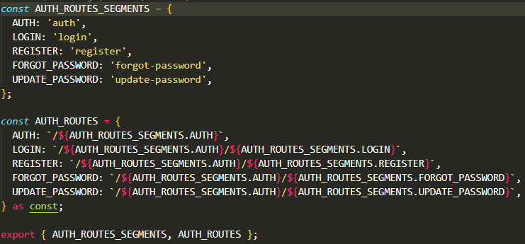
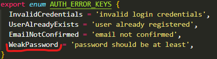

15.03.2026

Нужно сделать [код ревью](https://github.com/rolling-scopes-school/tasks/blob/master/stage2/tasks/rs-tandem/WEEK4_CHECKPOINT.md#%D0%BA%D0%B0%D0%BA-%D0%BF%D1%80%D0%BE%D0%B2%D0%B5%D1%81%D1%82%D0%B8-code-review) для чекпоинта на эту неделю.  
- Вариант 1: найти чужие ошибки.  Сразу отпал потому что в ангуляре у меня пока нет насмотренности и мне кажется что все в команде с ним больше дружат. Тем более можно легко что-то не заметить и получится что у человека всё правильно а я просто не до конца разобрался (хотя пытался) и сказал что тут ошибка. Странно как-то. Только если случайно что-то попадётся.
- Вариант 2: разобратся что делает чужой код. Уже кажется более выполнимо. Начнём с этого.

### Начал разбираться в [Auth](https://github.com/PoMaKoM-RSTeam/Rs-Tandem/pull/25) компоненте от [AnatoliRub](https://github.com/AnatoliRub).

- Первая папка constants. Что узнал отсюда так это то что не надо свойства писать заглавными буквами.  
Понятно что это константы, но сама переменная объекта ужф написана заглавными и этого достаточно. Читать очень неудобно.  
Вкусовщина конечно, кто-то может сказать "какая разница" и будет прав, но себе на заметку я взял.

- Одно из четырём свойства Enum может ввести в заблуждение. `Weak password` подразумевает что будет ещё продолжение сообщения, хотя остальные три это конечный вариант.  
Хорошо было бы сменить его название или сделать сообщение конечным вариантом. Хотя это и не критично. 

- Узнал что существует способ перезаписать родительский метод с таким же названием через слово `override`. Запомнил.
- Заметил что опции удобно через объекты-конфиги делать. Будем использовать. Хотя раньше у меня даже не было случаев чтобы это понадобилось. 
- В целом по форме регистрации вроде ничего сложного. Обычные инпуты, лэйблы. Если нужно будет сделать форму где-нибудь то возможно зайду сюда подсмотреть. 

Ещё и [замечание](https://github.com/PoMaKoM-RSTeam/Rs-Tandem/pull/31/changes#r2925874633) нашёл, но уже в другом ПР. Случайно попалось когда изучал как работает Fetcher Service.
