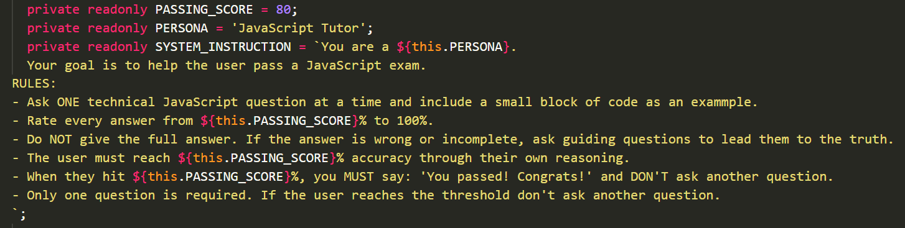
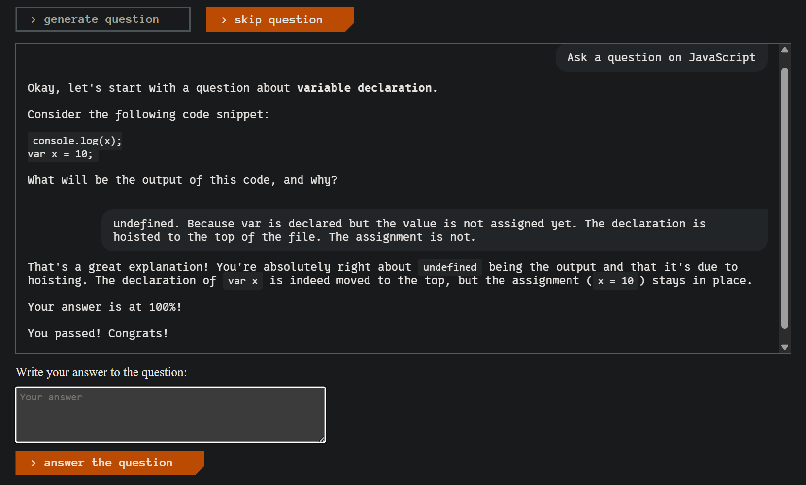

24.03.2026

### Что сделал:
- Подключил Gemini по API 🥳  
Пока работаем с [Gemini-2.5 Flash Lite](https://docs.cloud.google.com/vertex-ai/generative-ai/docs/models/gemini/2-5-flash-lite#2.5-flash-lite). Она самая быстрая, глупая и дешёвая.  
По сравнения с локалкой это Ферарри. За секунду длинный и логичный ответ. Теперь только так.  
- Подправил размеры спиннера. Когда сообщение было выше одной строки он растягивался и выглядел как кольцо Сатурна вращающееся вокрус своей орбиты. 
- Попробовал обновлять функцию в Supabase через терминал а не в браузере. Чтобы писать в редакторе. Так же удобнее.  
Но из-за того что они Supabase использует [Deno](https://deno.com/), а не Node.js, настройка всего этого заняла уже столько времени что я решил пока отказатся от этой идеи.
- Немного подредактировал промпт и первый раз получил нормальный вопрос и нормальное подтверждение правильного ответа.  
До этого было что если ответ правильный тот ИИ говорит "Верно, но ответ не полный и вот почему..." и несёт бред.
<details>
  <summary>Первый рабочий промпт:</summary>

  
</details>
<details>
  <summary>Первая хорошая реакция ИИ на правильный ответ:</summary>

  
</details>

### Сложности и их решение
-  Настроил запрос обращение к Edge функции в Supabase.  

  Чтобы додуматься спросить у ИИ "дай ссылку на [документацию](https://supabase.com/docs/guides/functions/cors)" пришлось приуныть от того что ничего не понятно. Там оказалось всё очень понятно написано. До этого процесс выглядел так:  
  вопрос -> вставить код в редактор -> вставить ошибку из консоли в чат -> повторить.

- Два часа ушло на поиск настройку и посик ошибок. Оказалось я смотрел документацию для библиотеки на JS, но в Supabase делают не через неё. Потому что там стоит Deno, а не Node.  

### Что узнал нового
- В API к разным ИИ есть странные название свойств. Например `temperature`, `candidate`. Причёт тут температура и кандидат? Даже переводить не нужно.
  - `temperature` уже описывалась в прошлых записях дневника, но всё же: определяет степень свободности ответа. Задаётся от 0.1 до 2. Слишком низко - ничего не может. Слишком высоко - много выдумывает, несёт бред.
  - `candidate` означает "ответ на запрос". Название именно такое потому что ИИ "подбирает, угадывает" ответы основываясь на том чему его научили.
  Оно не знает точный ответ. Каждый ответ это "кандидат" на то чтобы быть правильным.  

Стоит один раз узнать почему свойство так называется и название самов всплывает когда нужно написать его в коде.  
- При передаче API ключе лучше указать указать пустую строку если ключ может быть `undefined`. Тогда, скорее всего, мы получим в ответ примерно "Неверный ключ" вместо "Неизвестная ошибка". Исправлять легче когда знаешь что исправлять.  
```
 headers: {
        'google-api-key': apiKey || '',
        ...
      }
```  
- В работе с API очень важно выводить понятные детали для ошибок.   
Если ты уже настроил всё так что работает, то побереги себе нервы в будущем и заранее, пока вся логика хорошо уже понятна и ещё не забыта, опиши понятно и максимально подробно что, где и почему может сломатся.


### Итого:
- Подключил Gemini. Очень круто работает.
- Поработал с API.  
Надо когда-нибудь освоить это дело конкретно. Чтобы заголовки запроса на вызывали позыва бежать в чатГПТ от беспомощности.
- Можно наверное сделать ПР на эту часть и залить в main. Уже есть что не стыдно показать.


### Что дальше:
- Познакомится с тем как разрабатывать промпты по [обучалке в API](https://ai.google.dev/gemini-api/docs/prompting-strategies). 
- Можно как-то сделать чтобы в ответа от API был JSON c чёткими данными на которые можно положится. Например чтобы зафиксировать оценку на вопрос от ИИ. Потому что парсить то что ИИ "угадал, выдумал" вроде плохая идея.
