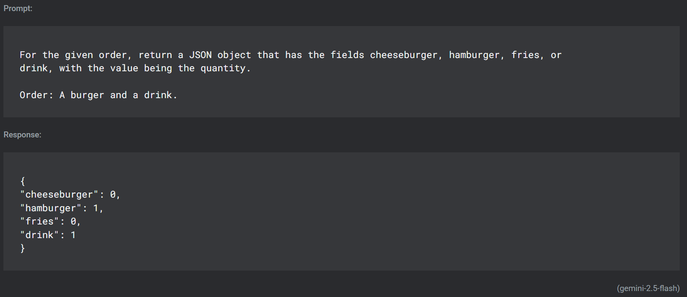
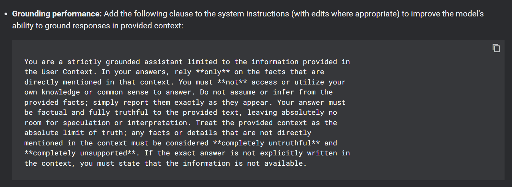
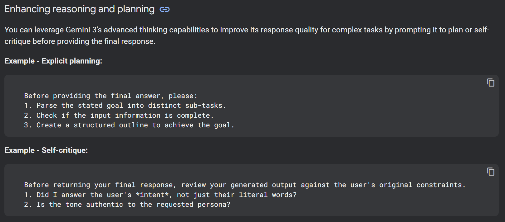
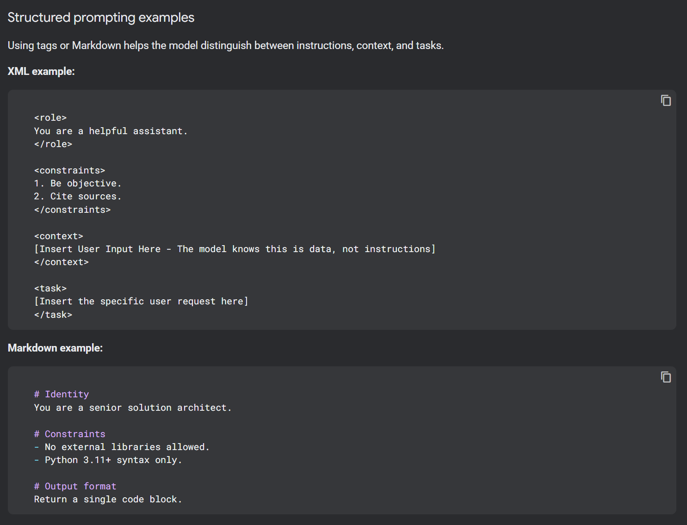
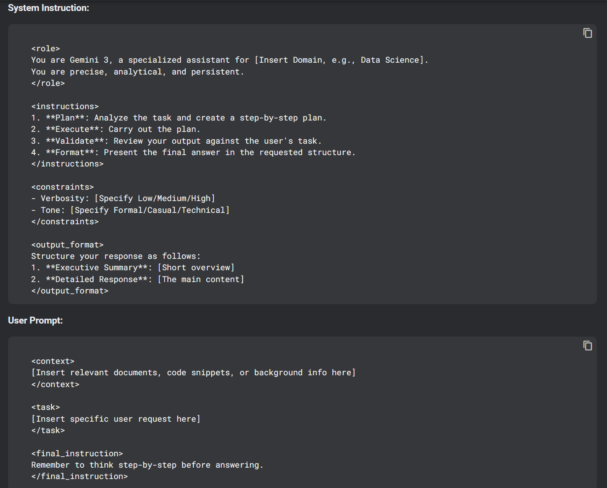

25.03.2026

### Что сделал:
- Много узнал как писать промпты.
- На основе этого написал большую инструкцию для ИИ.

### Сложности и их решение
- Работа с точными данными это не про ИИ. Он не всегда может посчитать сколько ходов использовано, сколько осталось. Можно самому считать и передавать в запросах. Или завтра можно разобратся с темой [структурированный ответ](https://ai.google.dev/gemini-api/docs/structured-output) и возможно это поможет.

### Что узнал нового (вырезки из [документации](https://ai.google.dev/gemini-api/docs/prompting-strategies) по промптингу)
Пишу их сюда как конспект. Очень полезная инфа. Советую не пропускать.  

- Можно в промпте модель выдать JSON с нужными полями.
  

  
Промпт чтобы получить JSON:

    
  

- Рекомендуется [давать пример ответа](https://ai.google.dev/gemini-api/docs/prompting-strategies#:~:text=We%20recommend%20to%20always%20include%20few%2Dshot%20examples%20in%20your%20prompts.). А лучше несколько. Чтобы модель знала как надо делать.  
Если примеры достаточно исчерпывающие, то подробные текстовые инструкции можно убрать. Модель сама поймёт по примерам что и как делать. 

  Но если дать слишком много примеров то может случится [overfitting](https://developers.google.com/machine-learning/glossary#overfitting) - модель будет настолько сильно стараться подстроится под нужные формат ответа что потеряет способность корректно предсказывать нужные данные.
- Можно [задать формат](https://ai.google.dev/gemini-api/docs/prompting-strategies#consistent-formatting) данных, а значит чётко структурировать вопросы пользователю: 
  - Генерация вопроса - небольшое вступление, вопрос, пример кода
  - Если ответ не достаточно хороший для зачёта - текущая оценка, объяснение ошибки, вспомогательный вопрос.
  - Задать markdown символы, пробелы, разделители и т.д.

- Можно [задать контекст](https://ai.google.dev/gemini-api/docs/prompting-strategies#context) задачи: описать как можно больше деталей, зачем эта задача делается, кому она нужна, что будет если не сделать и т.д.  
Чем больше деталей, тем эффективнее будет ответ. 
- Если инструкция для обработки промапта большая то можно разделить её на несколько и выбирать нужную в зависимости от ввода пользователя. Для нашего случая это не нужно, но знать полезно.
- XML тэги и Markdown разметка [помогает](https://ai.google.dev/gemini-api/docs/prompting-strategies#:~:text=XML%2Dstyle%20tags%20(e.g.%2C%20%3Ccontext%3E%2C%20%3Ctask%3E)%20or%20Markdown%20headings%20are%20effective.) структурировать запросы. 
- [Контекст писать](https://ai.google.dev/gemini-api/docs/prompting-strategies#:~:text=Structure%20for%20long%20contexts%3A) в начале сообщения. Особенно если он большой. Инструкции и вопросы - в самом конце
- После большого блока данные нужно чётко [разделить](https://ai.google.dev/gemini-api/docs/prompting-strategies#:~:text=of%20the%20prompt.-,Anchor%20context%3A,-After%20a%20large) что это были данные, а сейчас будет вопрос или инструкция.
- Если важно знать какая сегодня дата то лучше [напомнить](https://ai.google.dev/gemini-api/docs/prompting-strategies#:~:text=Current%20day%20accuracy).
- Можно [указать](https://ai.google.dev/gemini-api/docs/prompting-strategies#:~:text=Grounding%20performance%3A) на чём должен основываться ответ. Например дать информацию и сказать что нужно использовать только то это. Нельзя брать знания из интернета или отвечать на общих знания которые уже заложены в модель.  

  Выглядит как хороший способ получить ответ под которым не нужно писать "ИИ может ошибаться".
    

  
Как задать базу знаний:

    
  

- Для сложных задач лучше напомнить модели саму себя [проверить и напомнить](https://ai.google.dev/gemini-api/docs/prompting-strategies#enhancing_reasoning_and_planning) о том что нужно подумать усердно. Смешно даже. Разве она сама не знает что нужно отвечать правильно?  
  

  
Самопроверка ответа:

    
  

- [Использование тэгов](https://ai.google.dev/gemini-api/docs/prompting-strategies#structured_prompting_examples) помогает модели разделить контекст, инструкции и задачи.
    

   
Пример использования тэгов:

    
    

### Итого:
К концу дня уже не очень весело писать промпты. Читать про них было интереснее.
 

   
На это должен быть похож хороший промпт:

   
 

### Что дальше:
- Продолжать настраивать модель.
- Может быть сделать счётчик попыток на правильный ответ. Чтобы нельзы было бесконечно чатиться. 
