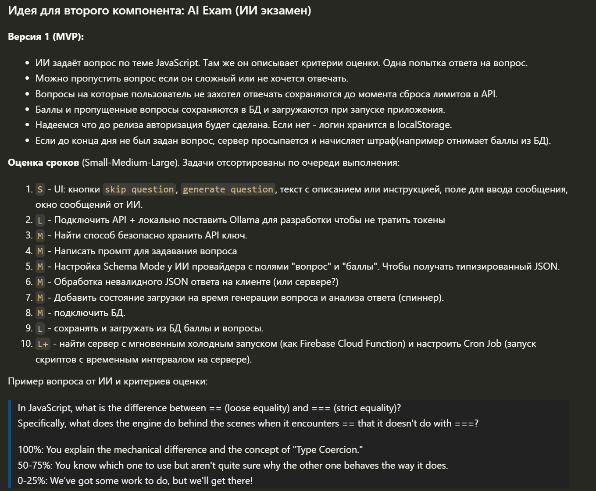
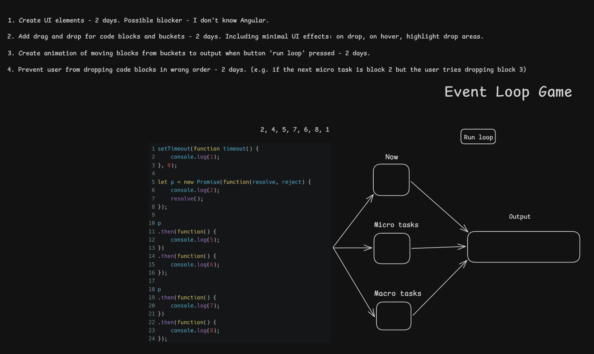
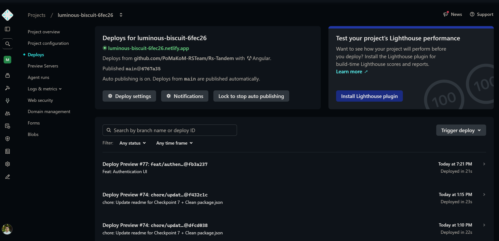
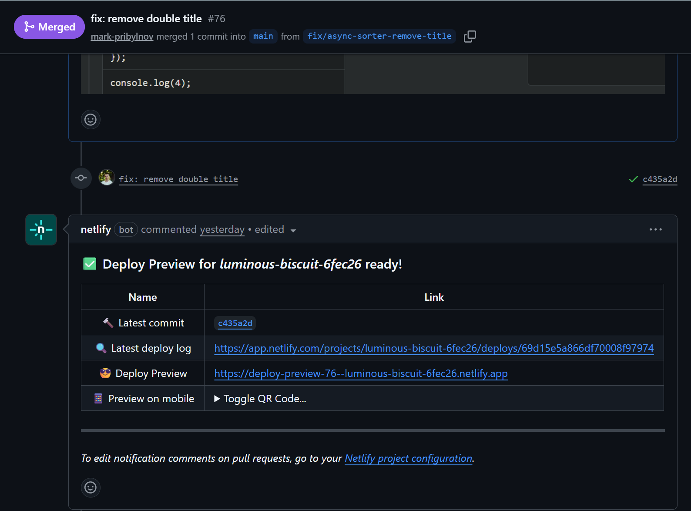

[PR с этим файлом](https://github.com/PoMaKoM-RSTeam/Rs-Tandem/pull/79)  
  
# Personal Features
  - Complex Component Chat UI (+25) - [Ссылка на GitHub](https://github.com/PoMaKoM-RSTeam/Rs-Tandem/tree/main/src/app/pages/games/ai-exam/components/chat)
  - Rich UI Screen: Реализация экрана со сложной логикой и состоянием  - игра Async-Sorter. Несколько drag & drop списков, подсчёт времени игры, определение ошибки пользователя, время игры до первой ошибки, сохранение всей статистики в БД. (+20) - [Ссылка на GitHub](https://github.com/PoMaKoM-RSTeam/Rs-Tandem/tree/main/src/app/pages/games/async-sorter)
  - Сложный бэкенд-сервис AI context manager. Находиться на фронте, но контекст задаёт. (+30) - [Ссылка на GitHub](https://github.com/PoMaKoM-RSTeam/Rs-Tandem/tree/main/src/app/pages/games/ai-exam/services/gemini)
  - BaaS CRUD: Работа с облачной БД (Firebase/Supabase), реализация минимум 1 endpoint - сохранение результатов игры в Supabase (+15) - [Ссылка на GitHub](https://github.com/PoMaKoM-RSTeam/Rs-Tandem/blob/main/src/app/pages/games/ai-exam/services/database.service.ts)
  - AI Chat UI: Интерфейс чата с отправкой промпта и отображением ответа LLM (+20) - [Ссылка на GitHub](https://github.com/PoMaKoM-RSTeam/Rs-Tandem/tree/main/src/app/pages/games/ai-exam/components/chat)
  - Raw LLM API: Интеграция без "magic" SDK (использование native fetch) (+10) - [Ссылка на GitHub](https://github.com/PoMaKoM-RSTeam/Rs-Tandem/blob/main/src/app/pages/games/ai-exam/services/gemini/gemini.service.ts)  
  [Открыть файл с Edge функцией](./files/Supabase-edge-function.example.ts)
    <details>
    <summary>Код Edge функции в Supabase</summary>

    ```
    import 'jsr:@supabase/functions-js/edge-runtime.d.ts';
    import { corsHeaders } from 'jsr:@supabase/supabase-js/cors';

    Deno.serve(async req => {
      if (req.method === 'OPTIONS') {
        return new Response('ok', { headers: corsHeaders });
      }

      try {
        const apiKeyPaid = Deno.env.get('GEMINI_KEY');
        const apiKeyFreeTier = Deno.env.get('GEMINI_FREE_TIER_KEY');
        const { model, contents, systemInstruction, generationConfig, useFreeTier  } = await req.json();

        const res = await fetch(`https://generativelanguage.googleapis.com/v1beta/models/${model}:generateContent`, {
          method: 'POST',
          headers: {
            'x-goog-api-key': useFreeTier ? apiKeyFreeTier : apiKeyPaid || '',
            'Content-Type': 'application/json',
          },
          body: JSON.stringify({
            contents, systemInstruction, generationConfig 
          }),
        });

        const data = await res.json();

        if (!res.ok) {
          console.error('Gemini API Error:', data.error);
          return new Response(JSON.stringify({ 
            error: 'Gemini API Error', 
            details: data.error?.message || 'Unknown configuration error' 
          }), {
            headers: { ...corsHeaders, 'Content-Type': 'application/json' },
            status: res.status, // Pass the 400, 401, etc., down to the client
          });
        }

        const text = data.candidates?.[0]?.content?.parts?.[0]?.text ?? 'I formulated an answer, but failed to output it.';

        return new Response(JSON.stringify({ data, text, supaData: {model, contents, systemInstruction, generationConfig } }), {
          headers: { ...corsHeaders, 'Content-Type': 'application/json' },
          status: 200,
        });
      } catch (error) {
        // Catch absolute failures (like Deno crashing or network timeouts)
        console.error('Edge Function Crash:', error);
        return new Response(JSON.stringify({ error: 'Internal Server Error', details: error.message }), {
          headers: { ...corsHeaders, 'Content-Type': 'application/json' },
          status: 500,
        });
      }
    });

    ```
    </details>
  - Local LLM: Запуск и интеграция локальных моделей Ollama (+10) - [Ссылка на GitHub](https://github.com/PoMaKoM-RSTeam/Rs-Tandem/pull/63/changes/10c0db21c0c8517eed2c7c8b18e1074a2ba66ea2) + записи дневника за 19, 20, 23 марта.
  - Drag & Drop (+10) - [Ссылка на GitHub](https://github.com/PoMaKoM-RSTeam/Rs-Tandem/tree/main/src/app/pages/games/async-sorter)
  - Advanced Animations (+10) - [Ссылка на GitHub](https://github.com/PoMaKoM-RSTeam/Rs-Tandem/blob/main/src/app/pages/games/async-sorter/async-sorter.ts#L138) (FLIP анимация)  
  - i18n: Локализация интерфейса (минимум 2 языка) с переключением (+10)  
  Мерж с локализацией от тиммейта где подредактировать его код - [Ссылка на GitHub](https://github.com/PoMaKoM-RSTeam/Rs-Tandem/pull/71/changes/b0b57cf8fe38082de6194e99b73ccd2512bde0f9)  
  - Architect: Документирование архитектурных решений (+10)  
    [Дневник с планом AI-Exam за 27 февраля](./mark-pribylnov-2026-02-27.md#идея-для-второго-компонента-ai-exam-ии-экзамен)
    <details>
      <summary>План компонента AI-Exam</summary>

      
    </details>  

    <details>
      <summary>Схема Async Sorter</summary>

     
    </details>  

  - Prompt Engineering: Документирование 3+ итераций улучшения промптов (+15). - [Pull Request и изменениями](https://github.com/PoMaKoM-RSTeam/Rs-Tandem/pull/63).  
  Конкретные коммиты с изменениями:  
      - [Commit 1](https://github.com/PoMaKoM-RSTeam/Rs-Tandem/pull/63/changes/100cc62312647324aed34106ff4160cf39f2277a)
      - [Commit 2](https://github.com/PoMaKoM-RSTeam/Rs-Tandem/pull/63/changes/fd73cb536fac6d9947bc62bdbf2219fb5413862c)
      - [Commit 3](https://github.com/PoMaKoM-RSTeam/Rs-Tandem/pull/63/changes/23b025e27b6c140745c43ee43a1cd0efee1632e7)
      - [Commit 4](https://github.com/PoMaKoM-RSTeam/Rs-Tandem/pull/63/changes/91e53c03f85eab42d3165806c1893f173bfb2311)
      - [Commit 5](https://github.com/PoMaKoM-RSTeam/Rs-Tandem/pull/63/changes/8204d48335e51f852e99586d21db686781e27268)
      - [Итоговый вариант](https://github.com/PoMaKoM-RSTeam/Rs-Tandem/blob/main/src/app/pages/games/ai-exam/services/gemini/prompt.ts)
  - [Auto-deploy](https://github.com/PoMaKoM-RSTeam/Rs-Tandem/pull/24) (Netlify) + [CI / CD](https://github.com/PoMaKoM-RSTeam/Rs-Tandem/pull/2) (+5)
    <details>
      <summary>Скрины автодеплоя</summary>

        
     
    </details>    
  - Design Patterns: Явное и обоснованное применение паттернов в коде (+10):  
    - Dependency Injection: [inject(GeminiService), inject(AiExamDatabaseService), inject(LanguagePreferenceService)](https://github.com/PoMaKoM-RSTeam/Rs-Tandem/blob/main/src/app/pages/games/ai-exam/ai-exam.ts#L74-L78)
    - Observer: Signals ([isLoading](https://github.com/PoMaKoM-RSTeam/Rs-Tandem/blob/main/src/app/pages/games/ai-exam/ai-exam.ts#L87), [attemptsLeft](https://github.com/PoMaKoM-RSTeam/Rs-Tandem/blob/main/src/app/pages/games/ai-exam/ai-exam.ts#L94), [examLanguage](https://github.com/PoMaKoM-RSTeam/Rs-Tandem/blob/main/src/app/pages/games/ai-exam/ai-exam.ts#L102))
    - Service Layer: [GeminiService](https://github.com/PoMaKoM-RSTeam/Rs-Tandem/tree/main/src/app/pages/games/ai-exam/services/gemini), [AiExamDatabaseService](https://github.com/PoMaKoM-RSTeam/Rs-Tandem/blob/main/src/app/pages/games/ai-exam/services/database.service.ts), [Async Sorter fetcher service](https://github.com/PoMaKoM-RSTeam/Rs-Tandem/blob/main/src/app/pages/games/async-sorter/services/async-sorter-fetcher.service.ts) 
    - Result Object pattern: [AskAiResult](https://github.com/PoMaKoM-RSTeam/Rs-Tandem/blob/main/src/app/pages/games/ai-exam/ai-exam.ts#L23), [GenerateQuestionResult](https://github.com/PoMaKoM-RSTeam/Rs-Tandem/blob/main/src/app/pages/games/ai-exam/ai-exam.ts#L37) со свойством `status`
  - API Layer: Выделение слоя работы с API (изоляция от UI компонентов) (+10):  
    - [компонент Async Sorter](https://github.com/PoMaKoM-RSTeam/Rs-Tandem/tree/main/src/app/pages/games/async-sorter/services)  
    - [компонент AI Exam](https://github.com/PoMaKoM-RSTeam/Rs-Tandem/tree/main/src/app/pages/games/ai-exam/services)
  - Angular: Использование фреймворка Angular (+10)

### Итоговая оценка - 220 баллов.

# Описание работы в рамках проекта

## Компонент 1 - Async Sorter (он же Event Loop Game)

Игра для изучения работы Event Loop в JavaScript.  
Пользователь должен правильно распределить блоки кода по очередям выполнения в том порядке, в котором их обработает движок JS.

### Что сделано:
- Интерфейс:  
    - Поле с блоками кода которые нужно перетащить.
    - Корзины в которые их нужно поместить.
    - Список куда блоки перемещаються после нажатия на кнопку `run loop`.
- Drag & Drop - перемещение элементов с поддержкой множества связанных списков.
- Валидация (Selective Dragging):  
  Игра подсказывает пользователю, правильно ли он расположил блок.  
  Изначально планировался запрет на дроп в неверную корзину, но из-за того что Angular запоминанает последнюю валидную зону, решение было переработано: теперь блок можно бросить везде, но при ошибке отображается иконка ❌ или ✅.
- Анимация по паттерну FLIP для плавного перемещения блоков из корзин на итоговую позицию по нажатию кнопки `Run loop`.  
Во время анимации перетаскивание блокируется для предотвращения багов.
- Управление состоянием:  
  - Страница игры хранит состояние и спускает его дочерним компонентам (`task-bucket-list` -> `task-bucket`)  
  - Изменения поднимаются наверх через события используя Angular функцию `output`
- Игровая статистика:  
  - Таймер автоматически запускается и удаляется при уничтожении компонента.
  - Счетчики ходов и ошибок. Считает в том числе ходы до первой ошибки.
- Сохранение дынных завершённой игры вместе с `user_id` в таблице Supabase.

### Инструменты и технологии:
- Angular (Signals, viewChild, HostBinding/host object, ChangeDetectionStrategy.OnPush, CDK модуль DragDrop).
- RxJS (`interval`, `Subscription` для таймера).
- SCSS (переменные для применения общих стилей проекта, миксины чтобы не дублировать код).
- Supabase.

### Что было сложным:
- Баги анимации:  
  Элементы мелькали на 0.1 секунды перед началом FLIP-анимации. Пришлось разобраться с тем как работает `requestAnimationFrame` и как помогает вложенный `rAF`. 
- Коммуникация компонентов:    
  Построение цепочки событий для активации кнопки "Run loop" (когда дочерний компонент должен сообщить родителю, что все корзины заполнены). Пришлось узнать что такое `@viewChild` и чем он лучше `document.querySelector()`

### Что сделано с нуля:  
- Логика компонента и всплытие событий.
- Выборочного перетаскивание (в какую корзину можно перетащить блок) и валидации решений пользователя.
- FLIP-анимация.
- Подключение к базе данных Supabase.


## Компонент 2: AI-Exam

Чат-бот в роли экзаменатора по JavaScript.  
Задает вопросы, оценивает ответы студента и сохраняет результаты.

### Что сделано:
- Интерфейс    
  - Окно чата с сообщениями пользователя и ИИ.  
  - Кнопками генерации и пропуска вопросов.
  - Спинер при ожидании ответа от API.
  - Временная блокировка инпутов чтобы не вызодить за рамки лимитов по запросам.
  - ИИ общаеться на том языке, который выбран у пользователя для всего приложения. 
- Ответы бота форматируются через `ngx-markdown`.
- Интеграция с LLM.  
Попробовал локальные модели через Ollama: `phi3`, `deepseek-r1`, `llama3.1`. Они намного хуже облачных. Остановился на облачной `Gemini`.
- Сложный промпт.  
Использованые техники: показ примеров ответа, использование XML тэгов для разделения задач, установление запретов, описание роли модели в качестве которой они должна оценивать ответа (например "строгий преподаватель")
- Настроена `jsonSchema`.  
Модель возвращает ответ в строгом JSON-формате (поля `isExamFinished`, `score`), что позволяет менять UI на основе её ответов.
- История чата передаётся с каждым новым запросом, так как ИИ не имеет собственной памяти.
- Сохранение в БД результатов экзамена: (зачет/незачет), количества использованных попыток и самого вопроса.

### Инструменты и технологии:
- Supabase Edge Functions для обхода CORS. Там же храниться API ключ.
- Gemini API.
- Ollama (для изначальной локальной разработки и экономии токенов).
- `ngx-markdown` для форматирования ответов модели.

### Что было сложным:
-  Галлюцинации и нестабильность ИИ:  
  Модель может засчитать ответ как 100% верный, а в следующий раз задать тот же вопрос и поставить 0 баллов за тот же ответ.  
  Решение - просто улучшать промпт, тестировать, снова улучшать.
- Передача логики подсчета попыток модели оказалась плохой идеей.  
Она не умеет запоминать состояние между запросами и поэтому может ошибиться при увеличении числа на еденицу из прошлого запроса.  
Решение - вынести подсчёта на клиент и передавать нужную информацию с каждым запросом.
- Модель задаёт одни и те же несколько вопросов:  
  Потому что они самые обсуждаемые в интернете.  
  Решение - сделать массив из 25 тем, который перемешивается. Модель каждый раз получает 3 случайные темы для генерации нового вопроса.
- Обход CORS. Облачные провайдеры блокируют запросы с фронтенда. Сделал Edge функцию в Supabase и через неё идёт общение с API. 
- Постоянно нужно улучшать промпт.  
Никогда не знаешь где ИИ начнёт делать то что не надо.  Нужно долго тестировать перед тем как получиться результат за который будет не стыдно.

### Что сделано с нуля:
- Интеграция с ИИ провайдером через Edge функцию.
- Логика экзаменатора: системные промпты, алгоритмы случайного выбора тем для разнообразия вопросов, обработка JSON от ИИ и парсинг ответов.
- Управление историей диалога.
- Механизмы обхода лимитов API - кнопка пропуска вопроса с таймаутом.
